# Phân tích luồng dữ liệu chính của HIV Clinic Booking System

## Tổng quan hệ thống

HIV Clinic Booking System là một ứng dụng web quản lý phòng khám HIV với kiến trúc microservice sử dụng:
- **Frontend**: React.js với Context API và hooks
- **Backend**: Spring Boot với RESTful API
- **Database**: Microsoft SQL Server
- **Security**: JWT-based authentication với Spring Security

## 1. Luồng Authentication & Authorization

### 1.1 Đăng nhập (Login Flow)

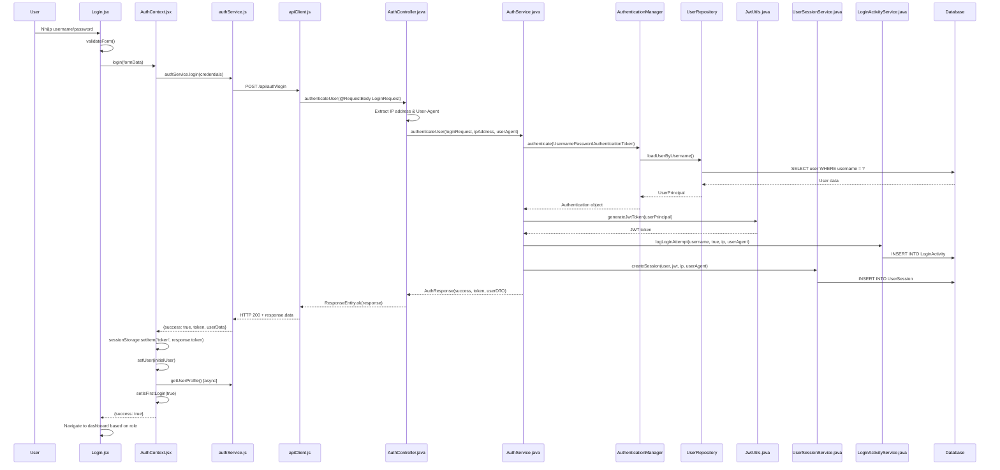

**Key Methods:**
- Frontend: `AuthContext.login()` → `authService.login()`
- Backend: `AuthController.authenticateUser()` → `AuthService.authenticateUser()`

**Database Operations:**
- Validate user credentials
- Log login activity
- Create user session
- Store JWT token mapping

### 1.2 Session Management & Monitoring

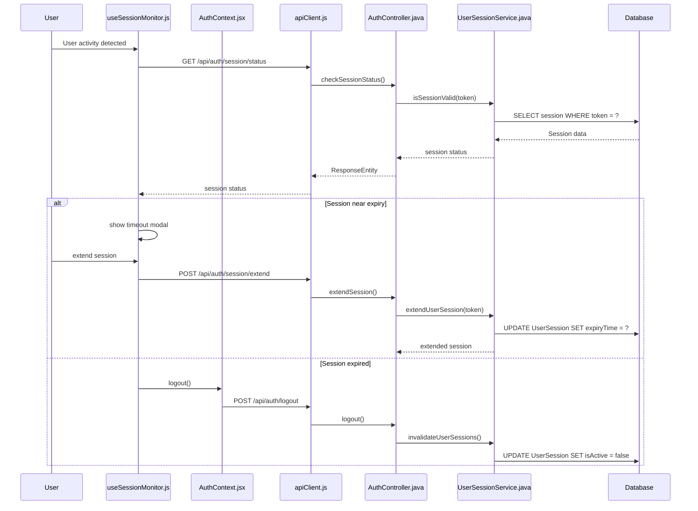

## 2. Luồng Appointment Management

### 2.1 Đặt lịch hẹn (Book Appointment)

```mermaid
sequenceDiagram
    participant P as Patient
    participant CD as CustomerDashboard.jsx
    participant UC as UnifiedCalendar.jsx
    participant API as apiClient.js
    participant AC as AppointmentController.java
    participant AS as AppointmentService.java
    participant UR as UserRepository
    participant ASR as AvailabilitySlotRepository
    parameter AR as AppointmentRepository
    participant NS as NotificationSchedulingService.java
    participant DB as Database

    P->>CD: Select doctor from list
    CD->>API: GET /api/doctors/available-slots?doctorId={id}
    API->>AC: getDoctorAvailableSlots()
    AC->>AS: getDoctorAvailableSlots(doctorId)
    AS->>ASR: findByDoctorUserAndIsBookedFalse()
    ASR->>DB: SELECT slots WHERE doctorId = ? AND isBooked = false
    DB-->>ASR: Available slots
    ASR-->>AS: List<DoctorAvailabilitySlot>
    AS-->>AC: Available slots
    AC-->>API: ResponseEntity.ok(slots)
    API-->>CD: available slots data
    
    CD->>UC: display calendar with available slots
    P->>UC: select date/time slot
    UC->>CD: booking request data
    CD->>API: POST /api/appointments/book
    API->>AC: bookAppointment(@RequestBody AppointmentBookingRequest)
    AC->>AS: bookAppointment(request, patientId)
    
    AS->>UR: validate patient exists
    AS->>UR: validate doctor exists
    AS->>ASR: validate slot availability
    AS->>ASR: findById(availabilitySlotId)
    AS->>AS: check for scheduling conflicts
    
    AS->>ASR: UPDATE slot SET isBooked = true
    AS->>AR: INSERT appointment
    AS->>DB: CREATE appointment record
    AS->>AS: createStatusHistory(appointment, "Scheduled")
    
    AS->>NS: scheduleAppointmentReminders(appointment)
    NS->>DB: INSERT reminder notifications
    
    AS-->>AC: MessageResponse.success()
    AC-->>API: ResponseEntity.ok()
    API-->>CD: booking success response
    CD->>CD: refresh appointments list
    CD->>CD: show success notification
```

**Key Validation Steps:**
1. Patient/Doctor role verification
2. Slot availability check
3. Time conflict detection
4. Business hours validation
5. Advance booking limits

### 2.2 Hủy lịch hẹn (Cancel Appointment)

```mermaid
sequenceDiagram
    participant P as Patient/Doctor
    participant CD as Dashboard
    participant API as apiClient.js
    participant AC as AppointmentController.java
    parameter AS as AppointmentService.java
    participant AR as AppointmentRepository
    participant ASR as AvailabilitySlotRepository
    participant AHS as AppointmentStatusHistory
    participant NS as NotificationService.java
    participant DB as Database

    P->>CD: Click cancel appointment
    CD->>CD: prompt for cancellation reason
    P->>CD: provide reason
    CD->>API: PUT /api/appointments/{id}/cancel?reason={reason}
    API->>AC: cancelAppointment(appointmentId, reason, userId)
    AC->>AS: cancelAppointment(appointmentId, userId, reason)
    
    AS->>AR: findById(appointmentId)
    AS->>AS: validate user permission
    AS->>AS: validate cancellation rules
    
    AS->>AR: UPDATE appointment SET status = 'Cancelled'
    AS->>AHS: INSERT status change history
    AS->>ASR: UPDATE slot SET isBooked = false
    AS->>NS: sendCancellationNotification()
    
    AS-->>AC: MessageResponse.success()
    AC-->>API: ResponseEntity.ok()
    API-->>CD: cancellation success
    CD->>CD: refresh appointments
    CD->>CD: show confirmation message
```

### 2.3 Quản lý lịch trình bác sĩ (Doctor Schedule Management)

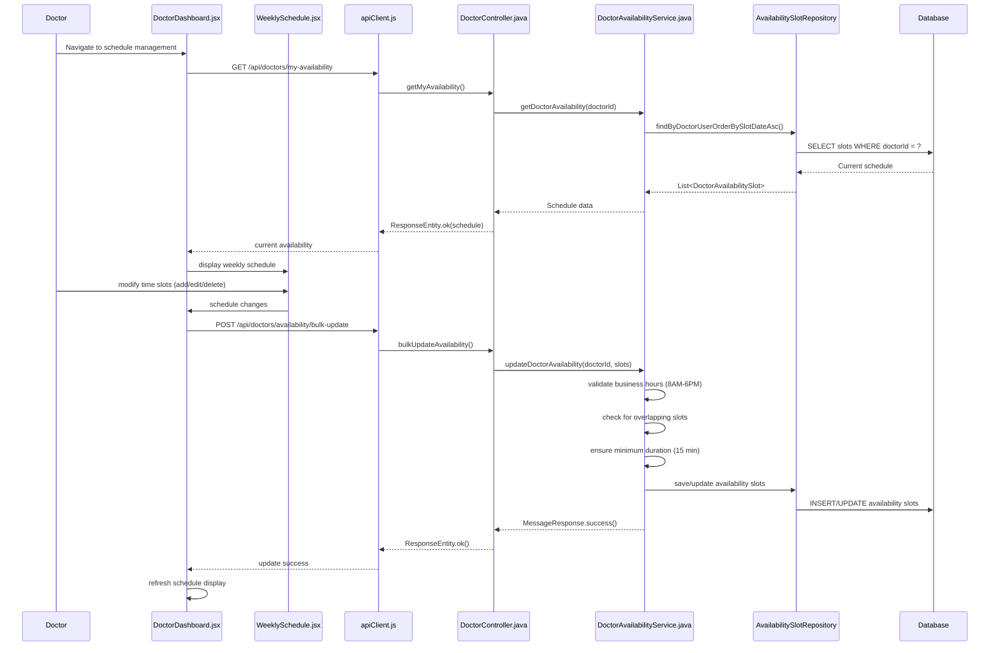

## 3. Luồng Patient Record Management

### 3.1 Xem hồ sơ bệnh án (View Medical Record)

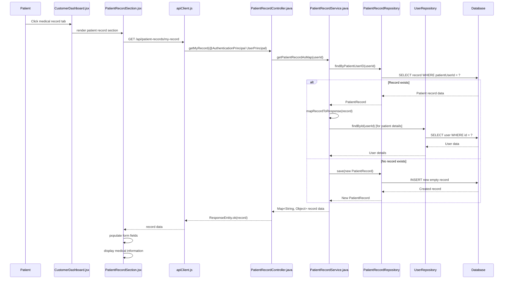

### 3.2 Cập nhật hồ sơ bệnh án (Update Medical Record)

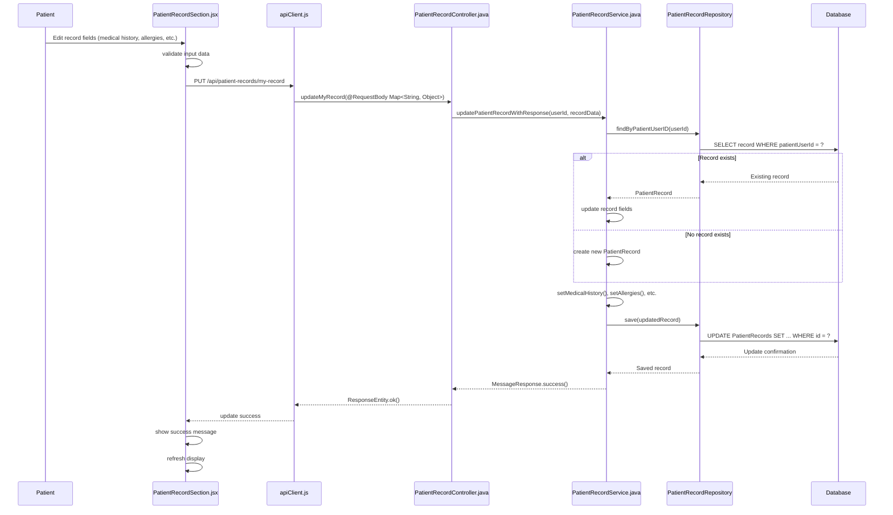

**Updateable Fields:**
- Medical History
- Known Allergies  
- Current Medications
- Clinical Notes
- Blood Type
- Emergency Contact Info
- Profile Image (Base64)

### 3.3 Truy cập hồ sơ bệnh nhân (Doctor Access to Patient Records)

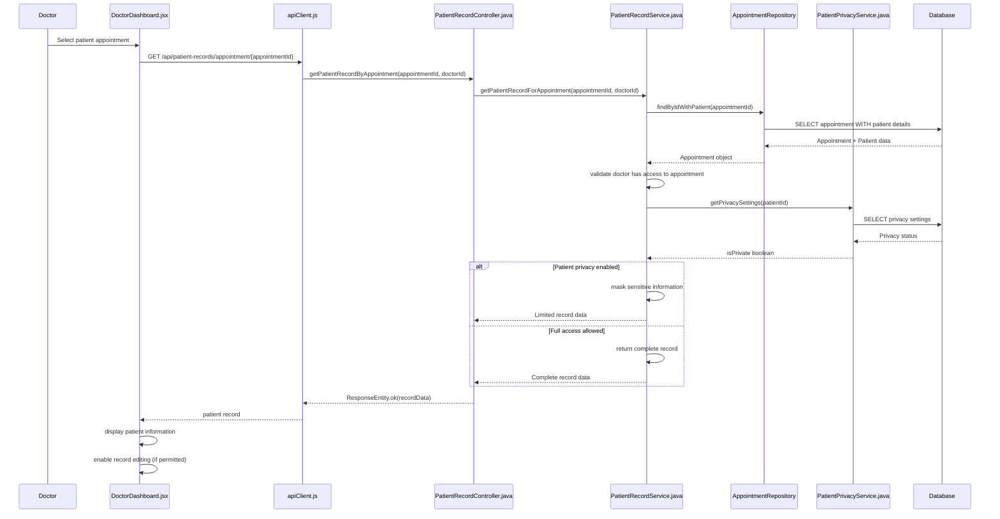

## 4. Luồng Notification System

### 4.1 Gửi thông báo (Send Notification)

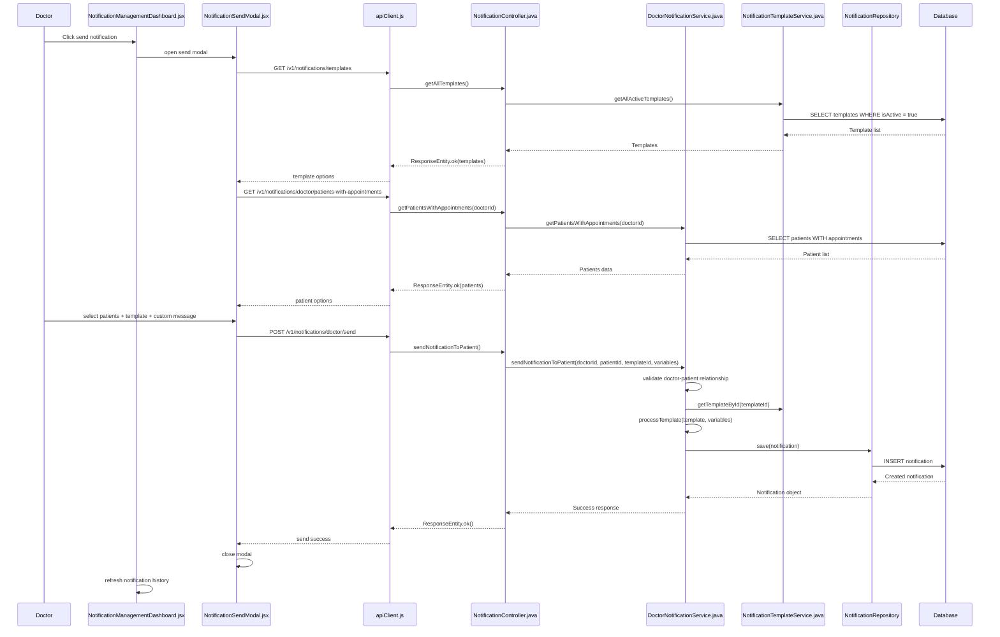

### 4.2 Lấy thông báo người dùng (Get User Notifications)

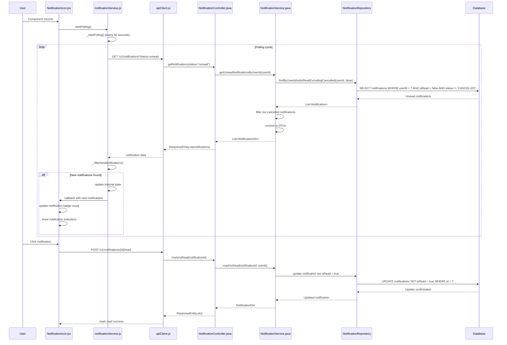

### 4.3 Quản lý lịch sử thông báo (Notification History Management)

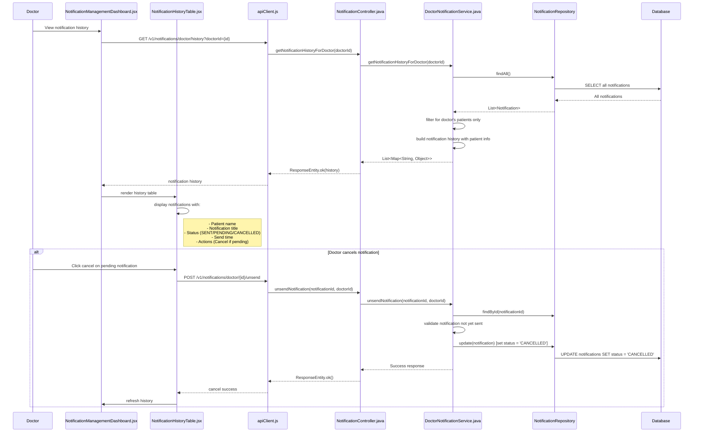

## 5. Luồng ARV Treatment Management

### 5.1 Tạo phác đồ điều trị ARV (Create ARV Treatment)

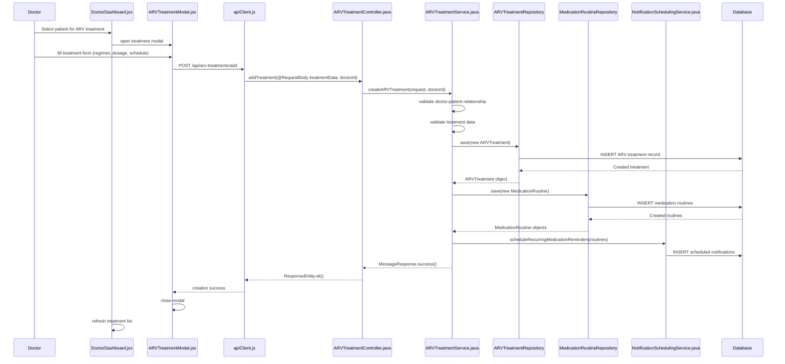

### 5.2 Theo dõi tuân thủ điều trị (Treatment Adherence Monitoring)

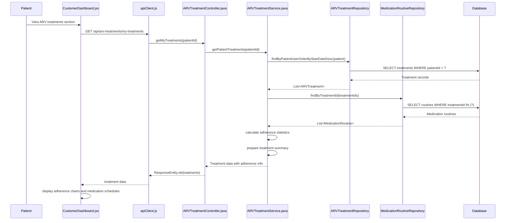

## 6. Luồng User Management (Admin)

### 6.1 Tạo tài khoản người dùng (Create User Account)

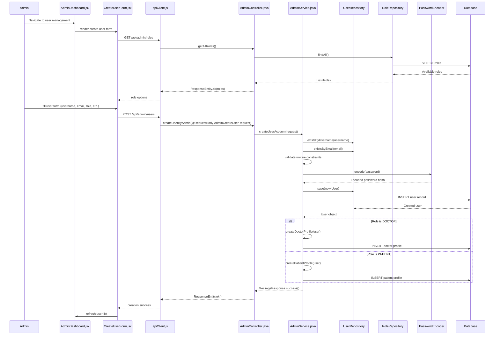

### 6.2 Quản lý danh sách người dùng (User List Management)

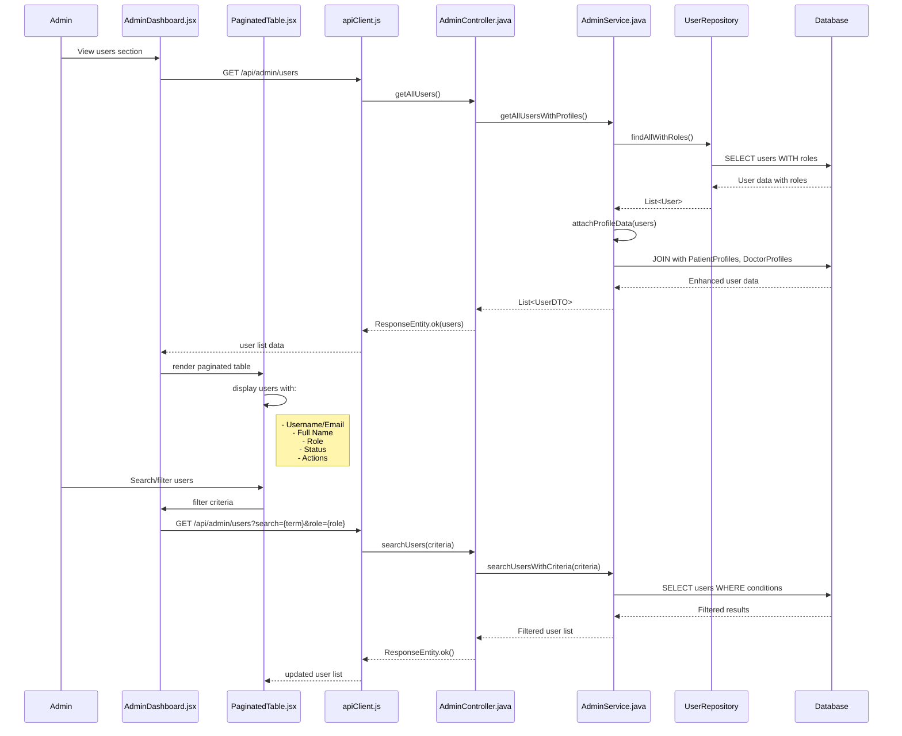

## 7. Luồng Data Export (Manager)

### 7.1 Xuất báo cáo CSV (CSV Export)

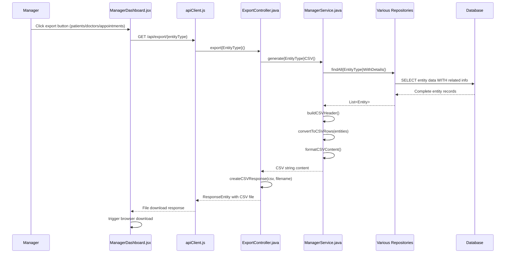

## 8. Common Patterns và Best Practices

### 8.1 Frontend Patterns

#### State Management
```javascript
// Context + Reducer pattern
const AuthContext = createContext();
const [user, setUser] = useState(null);
const [loading, setLoading] = useState(false);

// Custom hooks for reusable logic
const useAuth = () => useContext(AuthContext);
const useSessionMonitor = (isAuthenticated, logout) => {
  // Session monitoring logic
};
```

#### API Integration
```javascript
// Centralized API client với interceptors
const apiClient = axios.create({
  baseURL: 'http://localhost:8080/api',
  timeout: 30000
});

// Request interceptor cho JWT
apiClient.interceptors.request.use(config => {
  const token = sessionStorage.getItem('token');
  if (token) {
    config.headers.Authorization = `Bearer ${token}`;
  }
  return config;
});

// Response interceptor cho error handling
apiClient.interceptors.response.use(
  response => response,
  error => {
    if (error.response?.status === 401) {
      sessionStorage.removeItem('token');
      window.location.href = '/login';
    }
    return Promise.reject(error);
  }
);
```

#### Form Validation
```javascript
const validateForm = () => {
  const errors = {};
  
  if (!formData.username) errors.username = 'Username is required';
  if (!formData.email || !/\S+@\S+\.\S+/.test(formData.email)) {
    errors.email = 'Valid email is required';
  }
  
  setValidationErrors(errors);
  return Object.keys(errors).length === 0;
};
```

### 8.2 Backend Patterns

#### Controller Layer
```java
@RestController
@RequestMapping("/api/entity")
@CrossOrigin(origins = "*", maxAge = 3600)
@PreAuthorize("hasRole('ROLE')")
public class EntityController {
    
    @Autowired
    private EntityService entityService;
    
    @PostMapping("/create")
    public ResponseEntity<?> createEntity(
            @Valid @RequestBody EntityRequest request,
            @AuthenticationPrincipal UserPrincipal userPrincipal) {
        try {
            MessageResponse response = entityService.createEntity(request, userPrincipal.getId());
            return response.isSuccess() 
                ? ResponseEntity.ok(response)
                : ResponseEntity.badRequest().body(response);
        } catch (Exception e) {
            logger.error("Error creating entity: {}", e.getMessage(), e);
            return ResponseEntity.status(HttpStatus.INTERNAL_SERVER_ERROR)
                .body(MessageResponse.error("Failed to create entity"));
        }
    }
}
```

#### Service Layer
```java
@Service
@Transactional
public class EntityService {
    
    @Autowired
    private EntityRepository entityRepository;
    
    public MessageResponse createEntity(EntityRequest request, Integer userId) {
        try {
            // Validation
            validateRequest(request);
            
            // Business logic
            Entity entity = new Entity();
            mapRequestToEntity(request, entity);
            
            // Save
            Entity savedEntity = entityRepository.save(entity);
            
            // Post-processing
            handlePostCreation(savedEntity);
            
            logger.info("Entity created successfully: {}", savedEntity.getId());
            return MessageResponse.success("Entity created successfully");
            
        } catch (Exception e) {
            logger.error("Error creating entity: {}", e.getMessage(), e);
            return MessageResponse.error("Failed to create entity: " + e.getMessage());
        }
    }
}
```

#### Security Configuration
```java
// JWT-based authentication
@PreAuthorize("hasRole('PATIENT')")
@PreAuthorize("hasAnyRole('DOCTOR', 'ADMIN')")

// Role-based access control
if (!hasPermission(userPrincipal.getId(), resourceId)) {
    throw new SecurityException("Access denied");
}
```

### 8.3 Data Flow Security

#### Privacy Controls
```java
// Patient privacy filtering
if (patientPrivacyService.isPrivate(patientId)) {
    record.setEmergencyContact("Private");
    record.setEmergencyPhone("Private");
    record.setProfileImage(null);
}
```

#### Audit Logging
```java
// Activity logging
loginActivityService.logLoginAttempt(username, success, ipAddress, userAgent);

// Status change tracking
createStatusHistory(appointment, oldStatus, newStatus, reason, user);
```

#### Session Management
```java
// Session validation
public boolean isSessionValid(String token) {
    Optional<UserSession> session = userSessionRepository.findBySessionToken(token);
    return session.isPresent() && 
           session.get().getIsActive() && 
           session.get().getExpiryTime().isAfter(LocalDateTime.now());
}
```

### 8.4 Error Handling Patterns

#### Frontend Error Boundaries
```javascript
try {
  const response = await apiCall();
  if (response.success) {
    // Handle success
  } else {
    setError(response.message || 'Operation failed');
  }
} catch (error) {
  console.error('API Error:', error);
  setError(error.response?.data?.message || 'Network error occurred');
}
```

#### Backend Exception Handling
```java
try {
    // Business logic
    return processRequest(request);
} catch (ValidationException e) {
    logger.warn("Validation error: {}", e.getMessage());
    return ResponseEntity.badRequest().body(MessageResponse.error(e.getMessage()));
} catch (SecurityException e) {
    logger.error("Security violation: {}", e.getMessage());
    return ResponseEntity.status(HttpStatus.FORBIDDEN)
        .body(MessageResponse.error("Access denied"));
} catch (Exception e) {
    logger.error("Unexpected error: {}", e.getMessage(), e);
    return ResponseEntity.status(HttpStatus.INTERNAL_SERVER_ERROR)
        .body(MessageResponse.error("Internal server error"));
}
```

## 9. Performance Optimization

### 9.1 Database Optimization
- **Lazy Loading**: `@ManyToOne(fetch = FetchType.LAZY)`
- **Query Optimization**: Custom repository methods với JPQL
- **Index Usage**: Database indexes cho frequent queries
- **Connection Pooling**: HikariCP configuration

### 9.2 Frontend Optimization  
- **Code Splitting**: Dynamic imports cho large components
- **Memoization**: React.memo, useMemo, useCallback
- **Virtual Scrolling**: Cho large data lists
- **Debounced Search**: Reduce API calls

### 9.3 API Optimization
- **Pagination**: Limit results với Pageable
- **Field Selection**: Chỉ return required fields
- **Caching**: Redis cho frequently accessed data
- **Compression**: GZIP response compression

## 10. Monitoring và Analytics

### 10.1 Application Metrics
- Response times cho mỗi endpoint
- Error rates và exception tracking  
- User activity patterns
- Database query performance

### 10.2 Business Metrics
- Appointment booking rates
- Treatment adherence statistics
- User engagement metrics
- System usage analytics

Hệ thống HIV Clinic được thiết kế theo kiến trúc microservice với clear separation of concerns, robust security measures, và comprehensive audit trails để đảm bảo data integrity và patient privacy.
