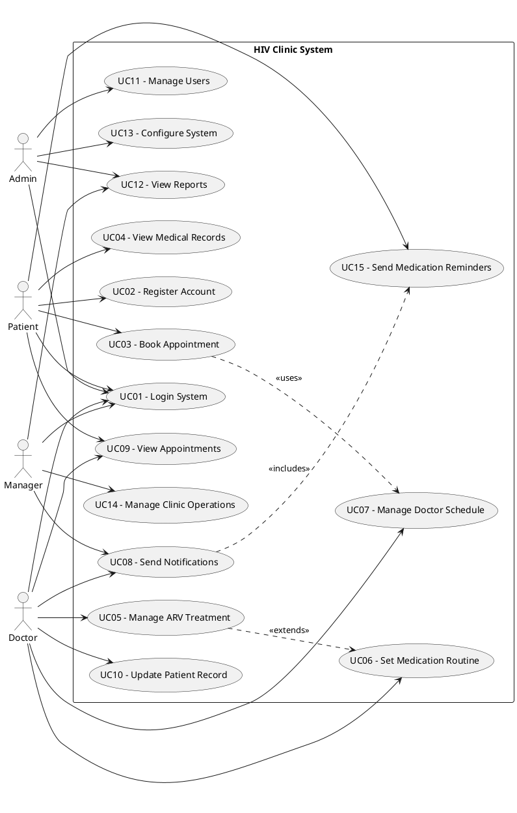
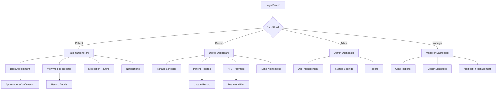
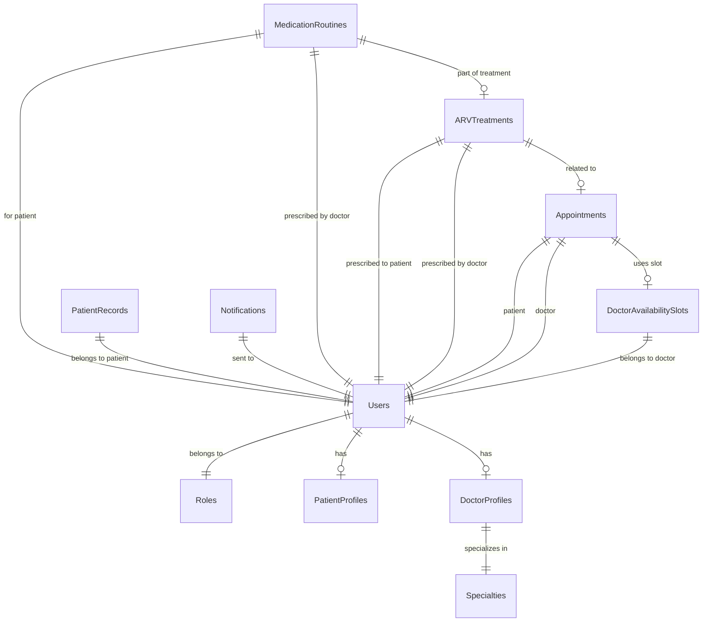
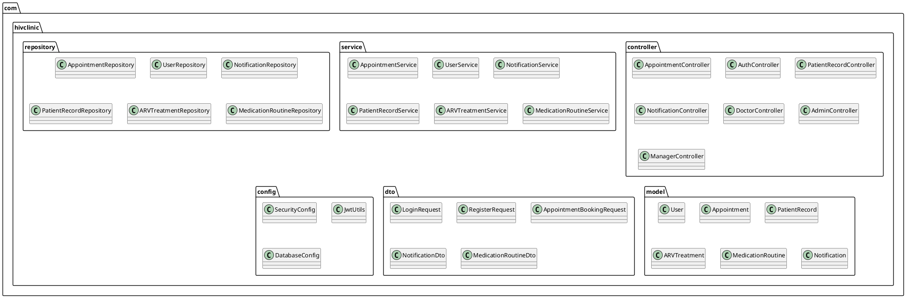

# Requirement & Design Specification

## HIV Clinic Appointment Booking System

**Version: 1.0**

---

## Record of Changes

| Version | Date | A*M, D | In charge | Change Description |
|---------|------|--------|-----------|-------------------|
| V1.0 | 06/01/2025 | A | Development Team | Initial version - HIV Clinic system specification |

*A - Added M - Modified D - Deleted

---

## Contents

1. [Overview](#overview)
   - 1.1 [Actors](#actors)
   - 1.2 [Use Cases](#use-cases)
2. [Overall Functionalities](#overall-functionalities)
   - 2.1 [Screens Flow](#screens-flow)
   - 2.2 [Screen Descriptions](#screen-descriptions)
   - 2.3 [Screen Authorization](#screen-authorization)
   - 2.4 [Non-UI Functions](#non-ui-functions)
3. [System High Level Design](#system-high-level-design)
   - 3.1 [Database Design](#database-design)
   - 3.2 [Code Packages](#code-packages)
4. [Requirement Specifications](#requirement-specifications)
5. [Design Specifications](#design-specifications)
6. [Appendix](#appendix)

---

## I. Overview

### 1. User Requirements

#### 1.1 Actors

The HIV Clinic Appointment Booking System involves four key actors with distinct roles and responsibilities:

| # | Actor | Description |
|---|-------|-------------|
| 1 | **Patient** | Individuals seeking HIV care and treatment services. Can book appointments, view medical records, manage medication routines, and receive notifications about appointments and medications. |
| 2 | **Doctor** | Healthcare professionals specializing in HIV/AIDS treatment. Can manage patient records, prescribe ARV treatments, set availability schedules, and send notifications to patients. |
| 3 | **Admin** | System administrators responsible for user management, system configuration, and overall system maintenance. Can manage all user accounts, view system reports, and configure system settings. |
| 4 | **Manager** | Clinical managers overseeing clinic operations. Can view operational reports, manage doctor schedules, send clinic-wide notifications, and monitor system performance. |

#### 1.2 Use Cases

**a. Diagram(s)**



**b. Descriptions**

| ID | Feature | Use Case | Use Case Description |
|----|---------|----------|---------------------|
| 01 | Authentication | Login System | Users authenticate to access system features based on their role |
| 02 | User Management | Register Account | New users can create accounts with appropriate role assignment |
| 03 | Appointment Booking | Book Appointment | Patients can book appointments with available doctors |
| 04 | Medical Records | View Medical Records | Patients can view their medical history and treatment records |
| 05 | ARV Treatment | Manage ARV Treatment | Doctors can prescribe and monitor antiretroviral treatments |
| 06 | Medication Management | Set Medication Routine | Doctors can set daily medication schedules with reminders |
| 07 | Schedule Management | Manage Doctor Schedule | Doctors can set their availability slots for appointments |
| 08 | Communication | Send Notifications | Send targeted notifications to users about appointments and treatments |
| 09 | Appointment Tracking | View Appointments | Users can view their scheduled, completed, and cancelled appointments |
| 10 | Patient Care | Update Patient Record | Doctors can update patient medical records after consultations |
| 11 | System Administration | Manage Users | Admins can create, update, and deactivate user accounts |
| 12 | Reporting | View Reports | Managers and admins can view system usage and clinical reports |
| 13 | System Configuration | Configure System | Admins can modify system settings and notification templates |
| 14 | Clinic Operations | Manage Clinic Operations | Managers can oversee clinic workflow and resource allocation |
| 15 | Medication Reminders | Send Medication Reminders | Automated reminders for patients about medication schedules |

### 2. Overall Functionalities

#### 2.1 Screens Flow



#### 2.2 Screen Descriptions

| # | Feature | Screen | Description |
|---|---------|--------|-------------|
| 1 | Authentication | Login Screen | User authentication with username/password and role-based redirection |
| 2 | Dashboard | Patient Dashboard | Patient's main interface showing appointments, notifications, and quick actions |
| 3 | Dashboard | Doctor Dashboard | Doctor's interface displaying patient list, schedule, and treatment management |
| 4 | Dashboard | Admin Dashboard | System administration interface for user and system management |
| 5 | Dashboard | Manager Dashboard | Clinical management interface for reports and clinic operations |
| 6 | Appointment | Book Appointment | Patient interface for selecting doctors and available time slots |
| 7 | Appointment | Appointment Confirmation | Confirmation screen showing appointment details and booking success |
| 8 | Medical Records | View Medical Records | Patient's medical history, treatments, and test results |
| 9 | Medical Records | Update Record | Doctor's interface for updating patient medical information |
| 10 | Treatment | ARV Treatment Plan | Doctor's interface for managing antiretroviral treatment regimens |
| 11 | Medication | Medication Routine | Interface for setting and viewing daily medication schedules |
| 12 | Schedule | Doctor Schedule | Doctor's availability management with time slot configuration |
| 13 | Notifications | Notification Center | Interface for viewing and managing system notifications |
| 14 | Administration | User Management | Admin interface for creating and managing user accounts |
| 15 | Reports | Clinical Reports | Manager and admin interface for viewing system usage and clinical data |

#### 2.3 Screen Authorization

| Screen | Patient | Doctor | Admin | Manager |
|--------|---------|--------|-------|---------|
| **Login Screen** | X | X | X | X |
| **Patient Dashboard** | X | | | |
| **Doctor Dashboard** | | X | | |
| **Admin Dashboard** | | | X | |
| **Manager Dashboard** | | | | X |
| **Book Appointment** | X | | | |
| **View Medical Records** | X | X | | |
| **Update Patient Record** | | X | | |
| **ARV Treatment Management** | | X | | |
| **Medication Routine** | X | X | | |
| **Doctor Schedule** | | X | | X |
| **Send Notifications** | | X | X | X |
| **User Management** | | | X | |
| **System Settings** | | | X | |
| **Clinical Reports** | | | X | X |
| **Notification Management** | | X | X | X |

#### 2.4 Non-UI Functions

| # | Feature | System Function | Description |
|---|---------|-----------------|-------------|
| 1 | **Notifications** | Appointment Reminder Service | Automated service that sends appointment reminders 24 hours, 1 hour, and 30 minutes before appointments |
| 2 | **Notifications** | Medication Reminder Service | Daily service that sends medication reminders based on patient routines |
| 3 | **Security** | Password Reset Service | Automated service for handling password reset requests with token generation |
| 4 | **Data** | Database Backup Service | Scheduled service for creating regular database backups |
| 5 | **Security** | Account Lockout Service | Service that monitors failed login attempts and locks accounts after 6 consecutive failures |
| 6 | **Reporting** | Report Generation Service | Service that generates clinical and system usage reports |
| 7 | **Data** | Data Validation Service | Service that validates and sanitizes user input data |
| 8 | **Integration** | External API Service | Service for integrating with external healthcare systems |

### 3. System High Level Design

#### 3.1 Database Design

**a. Database Schema**



**b. Table Descriptions**

| No | Table | Description |
|----|-------|-------------|
| 01 | **Users** | Core user table storing all system users (patients, doctors, admins, managers) |
| | | - Primary keys: UserID |
| | | - Foreign keys: RoleID (references Roles table) |
| | | - Unique constraints: Username, Email |
| | | - Security: PasswordHash field stores BCrypt hashed passwords |
| 02 | **Roles** | User role definitions for role-based access control |
| | | - Primary keys: RoleID |
| | | - Contains: Patient, Doctor, Admin, Manager roles |
| | | - Used for authorization and screen access control |
| 03 | **PatientProfiles** | Extended profile information specific to patients |
| | | - Primary keys: PatientProfileID |
| | | - Foreign keys: UserID (references Users table) |
| | | - Privacy: IsPrivate field controls record visibility |
| 04 | **DoctorProfiles** | Extended profile information specific to doctors |
| | | - Primary keys: DoctorProfileID |
| | | - Foreign keys: UserID (references Users table), SpecialtyID (references Specialties table) |
| | | - Contains professional information and bio |
| 05 | **Specialties** | Medical specialties for categorizing doctors |
| | | - Primary keys: SpecialtyID |
| | | - Contains HIV/AIDS specialist, Infectious Disease, Internal Medicine |
| 06 | **Appointments** | Core appointment booking records |
| | | - Primary keys: AppointmentID |
| | | - Foreign keys: PatientUserID, DoctorUserID, AvailabilitySlotID |
| | | - Status tracking: Scheduled, Completed, Cancelled, No-Show |
| 07 | **DoctorAvailabilitySlots** | Doctor schedule and availability management |
| | | - Primary keys: AvailabilitySlotID |
| | | - Foreign keys: DoctorUserID (references Users table) |
| | | - Booking status: IsBooked field tracks slot availability |
| 08 | **PatientRecords** | Comprehensive patient medical records |
| | | - Primary keys: RecordID |
| | | - Foreign keys: PatientUserID (references Users table) |
| | | - Contains medical history, allergies, medications, emergency contacts |
| 09 | **ARVTreatments** | HIV-specific antiretroviral treatment records |
| | | - Primary keys: ARVTreatmentID |
| | | - Foreign keys: PatientUserID, DoctorUserID, AppointmentID |
| | | - Treatment tracking: regimen, adherence, side effects |
| 10 | **MedicationRoutines** | Daily medication schedules with reminder settings |
| | | - Primary keys: RoutineID |
| | | - Foreign keys: PatientUserID, DoctorUserID, ARVTreatmentID |
| | | - Reminder system: ReminderEnabled, ReminderMinutesBefore |
| 11 | **Notifications** | System notification management |
| | | - Primary keys: NotificationID |
| | | - Foreign keys: UserID (references Users table) |
| | | - Types: APPOINTMENT_REMINDER, MEDICATION_REMINDER, GENERAL_ALERT |
| 12 | **NotificationTemplates** | Reusable notification templates |
| | | - Primary keys: templateId |
| | | - Template system for consistent messaging |
| | | - Priority levels: LOW, MEDIUM, HIGH, URGENT |

#### 3.2 Code Packages

The system follows a layered architecture with clear separation of concerns:



**Package Descriptions**

| No | Package | Description |
|----|---------|-------------|
| 01 | **controller** | REST API controllers handling HTTP requests and responses |
| 02 | **service** | Business logic layer implementing use cases and workflows |
| 03 | **repository** | Data access layer for database operations |
| 04 | **model** | Entity classes representing database tables |
| 05 | **dto** | Data Transfer Objects for API request/response |
| 06 | **config** | Configuration classes for security, database, and system settings |

---

## II. Requirement Specifications

### 1. Authentication & User Management

#### 1.1 UC01 - Login System

**a. Functionalities**

**UC ID and Name:** UC01 - Login System

**Created By:** Development Team

**Date Created:** 06/01/2025

**Primary Actor:** Patient, Doctor, Admin, Manager

**Secondary Actors:** None

**Trigger:** User accesses the system login page or attempts to access protected resources

**Description:** Users authenticate to the system using username/password credentials. Upon successful authentication, users are redirected to their role-specific dashboard.

**Preconditions:**
- PRE-1: User account has been created and is active
- PRE-2: User has valid login credentials

**Postconditions:**
- POST-1: User is authenticated and logged into the system
- POST-2: User session is established with appropriate role permissions
- POST-3: Login activity is recorded in the system audit log

**Normal Flow:**
1. User accesses the login screen
2. User enters username and password
3. User clicks the Login button
4. System validates credentials against the database
5. System checks account status (active/inactive)
6. System creates user session with role-based permissions
7. System records successful login in audit log
8. System redirects user to appropriate dashboard based on role

**Alternative Flows:**
- 1.1 Password Reset: User clicks "Forgot Password" link and follows password reset process
- 1.2 Account Registration: New user clicks "Register" link to create account

**Exceptions:**
- 1.0.E1 Invalid credentials provided
  1. System displays error message "Invalid username or password"
  2. User can retry login or use password reset option
- 1.0.E2 Account locked due to multiple failed attempts
  1. System displays account locked message
  2. User must wait 30 minutes or contact administrator
- 1.0.E3 Account inactive or disabled
  1. System displays account disabled message
  2. User must contact administrator for account activation

**Priority:** Must Have

**Frequency of Use:** High - Multiple times daily per user

**Business Rules:** BR-01, BR-02, BR-03

**Other Information:** Session timeout after 30 minutes of inactivity

**Assumptions:** Users have basic computer literacy and internet access

#### 1.2 UC02 - Register Account

**a. Functionalities**

**UC ID and Name:** UC02 - Register Account

**Created By:** Development Team

**Date Created:** 06/01/2025

**Primary Actor:** Patient

**Secondary Actors:** Admin (for role assignment)

**Trigger:** New user clicks "Register" link on login page

**Description:** New users can create patient accounts to access the system. Admin approval may be required for account activation.

**Preconditions:**
- PRE-1: User has valid personal information
- PRE-2: Email address is not already registered

**Postconditions:**
- POST-1: New user account is created in the system
- POST-2: Account activation email is sent to user
- POST-3: Patient profile is created and linked to user account

**Normal Flow:**
1. User clicks "Register" link on login page
2. System displays registration form
3. User enters required information (username, email, password, personal details)
4. User agrees to terms and conditions
5. User clicks "Register" button
6. System validates all input fields
7. System creates new user account with Patient role
8. System creates patient profile record
9. System sends activation email to user
10. System displays registration success message

**Alternative Flows:**
- 2.1 Admin Registration: Admin creates accounts for doctors, managers, or other admins

**Exceptions:**
- 2.0.E1 Email already registered
  1. System displays error message
  2. User can try different email or use login option
- 2.0.E2 Invalid email format
  1. System displays validation error
  2. User corrects email format
- 2.0.E3 Password doesn't meet complexity requirements
  1. System displays password requirements
  2. User creates stronger password

**Priority:** Must Have

**Frequency of Use:** Medium - New patient registrations

**Business Rules:** BR-04, BR-05, BR-06

### 2. Appointment Management

#### 2.1 UC03 - Book Appointment

**a. Functionalities**

**UC ID and Name:** UC03 - Book Appointment

**Created By:** Development Team

**Date Created:** 06/01/2025

**Primary Actor:** Patient

**Secondary Actors:** Doctor (availability provider)

**Trigger:** Patient clicks "Book Appointment" from dashboard or navigation

**Description:** Patients can view available doctors and their time slots, then book appointments for consultations.

**Preconditions:**
- PRE-1: Patient is logged into the system
- PRE-2: At least one doctor has available time slots
- PRE-3: Patient profile is complete

**Postconditions:**
- POST-1: New appointment is created and stored in the system
- POST-2: Doctor's availability slot is marked as booked
- POST-3: Appointment confirmation is sent to patient and doctor
- POST-4: Appointment reminders are scheduled

**Normal Flow:**
1. Patient accesses appointment booking screen
2. System displays list of available doctors with specialties
3. Patient selects preferred doctor
4. System displays doctor's available time slots
5. Patient selects preferred date and time
6. System displays appointment summary
7. Patient confirms appointment details
8. System creates appointment record
9. System marks availability slot as booked
10. System sends confirmation notifications
11. System schedules automated reminders

**Alternative Flows:**
- 3.1 Reschedule Appointment: Patient modifies existing appointment
- 3.2 Cancel Appointment: Patient cancels scheduled appointment

**Exceptions:**
- 3.0.E1 No available slots for selected doctor
  1. System suggests alternative doctors or dates
  2. Patient can choose different option
- 3.0.E2 Selected time slot becomes unavailable
  1. System displays updated availability
  2. Patient selects new time slot
- 3.0.E3 Patient has conflicting appointment
  1. System displays conflict warning
  2. Patient can resolve conflict or choose different time

**Priority:** Must Have

**Frequency of Use:** High - Multiple bookings daily

**Business Rules:** BR-07, BR-08, BR-09

### 3. Medical Records Management

#### 3.1 UC04 - View Medical Records

**a. Functionalities**

**UC ID and Name:** UC04 - View Medical Records

**Created By:** Development Team

**Date Created:** 06/01/2025

**Primary Actor:** Patient, Doctor

**Secondary Actors:** None

**Trigger:** User clicks "Medical Records" from dashboard or navigation

**Description:** Patients can view their own medical records, while doctors can view records of their patients.

**Preconditions:**
- PRE-1: User is logged into the system
- PRE-2: Medical records exist for the patient
- PRE-3: User has appropriate permissions (patient viewing own records or doctor viewing patient records)

**Postconditions:**
- POST-1: Medical records are displayed to authorized user
- POST-2: Record access is logged for audit purposes

**Normal Flow:**
1. User accesses medical records screen
2. System verifies user permissions
3. System retrieves patient medical records
4. System displays records in organized format
5. User can view different sections (medical history, allergies, medications, treatments)
6. User can view specific record details
7. System logs record access for audit

**Alternative Flows:**
- 4.1 Filter Records: User filters records by date, type, or doctor
- 4.2 Print Records: User generates printable version of records

**Exceptions:**
- 4.0.E1 No medical records found
  1. System displays message indicating no records
  2. System suggests creating first record (for doctors)
- 4.0.E2 Access denied due to privacy settings
  1. System displays access denied message
  2. User contacts appropriate personnel for access

**Priority:** Must Have

**Frequency of Use:** Medium - Viewed before appointments and treatments

**Business Rules:** BR-10, BR-11, BR-12

### 4. Treatment Management

#### 4.1 UC05 - Manage ARV Treatment

**a. Functionalities**

**UC ID and Name:** UC05 - Manage ARV Treatment

**Created By:** Development Team

**Date Created:** 06/01/2025

**Primary Actor:** Doctor

**Secondary Actors:** Patient (treatment recipient)

**Trigger:** Doctor selects "ARV Treatment" from patient record or dashboard

**Description:** Doctors can create, modify, and monitor antiretroviral treatment plans for HIV-positive patients.

**Preconditions:**
- PRE-1: Doctor is logged into the system
- PRE-2: Patient has confirmed HIV diagnosis
- PRE-3: Doctor has authorization to prescribe ARV treatments

**Postconditions:**
- POST-1: ARV treatment plan is created or updated
- POST-2: Patient is notified of treatment plan
- POST-3: Medication routines are automatically generated
- POST-4: Treatment monitoring schedule is established

**Normal Flow:**
1. Doctor accesses patient's treatment management screen
2. System displays current treatment status and history
3. Doctor creates new treatment plan or modifies existing one
4. Doctor selects ARV regimen from available options
5. Doctor specifies treatment duration and monitoring schedule
6. Doctor adds notes about treatment rationale
7. System validates treatment plan
8. System creates treatment record
9. System generates associated medication routines
10. System notifies patient of new treatment plan

**Alternative Flows:**
- 5.1 Modify Treatment: Doctor adjusts existing treatment due to side effects or resistance
- 5.2 Discontinue Treatment: Doctor ends treatment plan with documented reasons

**Exceptions:**
- 5.0.E1 Drug interaction detected
  1. System displays interaction warning
  2. Doctor reviews and confirms treatment plan
- 5.0.E2 Patient allergy to prescribed medication
  1. System displays allergy alert
  2. Doctor selects alternative medication

**Priority:** Must Have

**Frequency of Use:** Medium - Treatment updates and new prescriptions

**Business Rules:** BR-13, BR-14, BR-15

---

## III. Design Specifications

### 1. Authentication System

#### 1.1 User Login

**a. Login Screen**

This screen allows users to authenticate to the system and access role-specific functionalities.

**Related Use Cases:** UC01 - Login System

**UI Design**

| Field Name | Field Type | Description |
|------------|------------|-------------|
| **Username*** | Text Box | User's unique username for system access |
| **Password*** | Password Box | User's password (masked input) |
| **Remember Me** | Checkbox | Option to remember login credentials |
| **Login** | Button | Primary action button to authenticate user |
| **Forgot Password?** | Hyperlink | Link to password reset functionality |
| **Register** | Button | Link to new user registration page |

**Database Access**

| Table | CRUD | Description |
|-------|------|-------------|
| Users | R | Verify username and password credentials |
| Roles | R | Retrieve user role for authorization |
| LoginActivity | C | Record login attempt for audit purposes |

**SQL Commands:**

```sql
-- 1. Verify user credentials
SELECT UserID, Username, PasswordHash, Email, FirstName, LastName, IsActive, RoleID
FROM Users 
WHERE Username = ? AND IsActive = 1;

-- 2. Get user role information
SELECT RoleName 
FROM Roles 
WHERE RoleID = ?;

-- 3. Record login activity
INSERT INTO LoginActivity (UserID, UsernameAttempted, IsSuccess, IPAddress, UserAgent)
VALUES (?, ?, ?, ?, ?);
```

### 2. Appointment Booking System

#### 2.1 Book Appointment

**a. Appointment Booking Screen**

This screen enables patients to book appointments with available doctors.

**Related Use Cases:** UC03 - Book Appointment

**UI Design**

| Field Name | Field Type | Description |
|------------|------------|-------------|
| **Select Doctor** | Dropdown | List of available doctors with specialties |
| **Appointment Date** | Date Picker | Calendar widget for date selection |
| **Available Time Slots** | Radio Buttons | List of available time slots for selected doctor |
| **Appointment Reason** | Text Area | Optional reason for appointment |
| **Special Instructions** | Text Area | Any special instructions or requirements |
| **Book Appointment** | Button | Primary action to confirm booking |
| **Cancel** | Button | Cancel booking process |

**Database Access**

| Table | CRUD | Description |
|-------|------|-------------|
| DoctorAvailabilitySlots | R | Retrieve available time slots for selected doctor |
| Appointments | C | Create new appointment record |
| DoctorAvailabilitySlots | U | Mark selected slot as booked |
| Notifications | C | Create appointment confirmation notifications |

**SQL Commands:**

```sql
-- 1. Get available doctors
SELECT u.UserID, u.FirstName, u.LastName, dp.Bio, s.SpecialtyName
FROM Users u
JOIN DoctorProfiles dp ON u.UserID = dp.UserID
JOIN Specialties s ON dp.SpecialtyID = s.SpecialtyID
WHERE u.RoleID = (SELECT RoleID FROM Roles WHERE RoleName = 'Doctor')
AND u.IsActive = 1;

-- 2. Get available time slots for doctor
SELECT AvailabilitySlotID, SlotDate, StartTime, EndTime
FROM DoctorAvailabilitySlots
WHERE DoctorUserID = ? AND SlotDate >= ? AND IsBooked = 0
ORDER BY SlotDate, StartTime;

-- 3. Create appointment
INSERT INTO Appointments (PatientUserID, DoctorUserID, AvailabilitySlotID, 
                         AppointmentDateTime, Status, AppointmentNotes)
VALUES (?, ?, ?, ?, 'Scheduled', ?);

-- 4. Mark slot as booked
UPDATE DoctorAvailabilitySlots 
SET IsBooked = 1, UpdatedAt = GETDATE()
WHERE AvailabilitySlotID = ?;
```

### 3. Medical Records System

#### 3.1 Patient Records Management

**a. Patient Record View**

This screen displays comprehensive patient medical information.

**Related Use Cases:** UC04 - View Medical Records, UC10 - Update Patient Record

**UI Design**

| Field Name | Field Type | Description |
|------------|------------|-------------|
| **Patient Information** | Section | Display patient demographics and contact info |
| **Medical History** | Text Area | Comprehensive medical history display/edit |
| **Current Medications** | List | Current medications with dosages |
| **Allergies** | List | Known allergies and reactions |
| **Blood Type** | Display | Patient's blood type |
| **Emergency Contact** | Display | Emergency contact information |
| **ARV Treatments** | Table | List of current and past ARV treatments |
| **Appointment History** | Table | Previous appointments and outcomes |
| **Update Record** | Button | Save changes to patient record (doctors only) |

**Database Access**

| Table | CRUD | Description |
|-------|------|-------------|
| PatientRecords | R, U | Retrieve and update patient medical records |
| Users | R | Get patient demographic information |
| ARVTreatments | R | Get patient's ARV treatment history |
| Appointments | R | Get patient's appointment history |
| MedicationRoutines | R | Get current medication schedules |

**SQL Commands:**

```sql
-- 1. Get patient record
SELECT pr.*, u.FirstName, u.LastName, u.Email, pp.DateOfBirth, pp.PhoneNumber
FROM PatientRecords pr
JOIN Users u ON pr.PatientUserID = u.UserID
JOIN PatientProfiles pp ON u.UserID = pp.UserID
WHERE pr.PatientUserID = ?;

-- 2. Get ARV treatments
SELECT arvt.*, du.FirstName + ' ' + du.LastName AS DoctorName
FROM ARVTreatments arvt
JOIN Users du ON arvt.DoctorUserID = du.UserID
WHERE arvt.PatientUserID = ? AND arvt.IsActive = 1
ORDER BY arvt.StartDate DESC;

-- 3. Update patient record
UPDATE PatientRecords 
SET MedicalHistory = ?, Allergies = ?, CurrentMedications = ?, 
    Notes = ?, UpdatedAt = GETDATE()
WHERE PatientUserID = ?;
```

### 4. Notification System

#### 4.1 Notification Management

**a. Notification Center**

This screen manages all system notifications and reminders.

**Related Use Cases:** UC08 - Send Notifications, UC15 - Send Medication Reminders

**UI Design**

| Field Name | Field Type | Description |
|------------|------------|-------------|
| **Notification List** | Table | List of all notifications with status |
| **Filter Options** | Dropdown | Filter by type, priority, or read status |
| **Notification Details** | Panel | Detailed view of selected notification |
| **Mark as Read** | Button | Mark selected notifications as read |
| **Send New Notification** | Button | Create and send new notification |
| **Template Selector** | Dropdown | Choose from predefined templates |
| **Recipient Selection** | Multi-select | Choose notification recipients |

**Database Access**

| Table | CRUD | Description |
|-------|------|-------------|
| Notifications | R, U, C | Manage all notification records |
| NotificationTemplates | R | Retrieve notification templates |
| Users | R | Get recipient information |
| MedicationRoutines | R | Get medication reminder data |
| Appointments | R | Get appointment reminder data |

**SQL Commands:**

```sql
-- 1. Get notifications for user
SELECT n.*, nt.name AS TemplateName
FROM Notifications n
LEFT JOIN NotificationTemplates nt ON n.templateId = nt.templateId
WHERE n.UserID = ?
ORDER BY n.CreatedAt DESC;

-- 2. Create new notification
INSERT INTO Notifications (UserID, Type, Title, Message, Priority, 
                          RelatedEntityID, RelatedEntityType, ScheduledFor)
VALUES (?, ?, ?, ?, ?, ?, ?, ?);

-- 3. Mark notification as read
UPDATE Notifications 
SET IsRead = 1, UpdatedAt = GETDATE()
WHERE NotificationID = ? AND UserID = ?;
```

---

## IV. Appendix

### 1. Assumptions & Dependencies

**Assumptions:**
- AS-1: Users have reliable internet connectivity for system access
- AS-2: Healthcare staff are trained in basic computer operations
- AS-3: Patient data privacy regulations (HIPAA compliance) are enforced
- AS-4: System operates during clinic hours with 24/7 availability for patients
- AS-5: Backup and disaster recovery procedures are in place

**Dependencies:**
- DE-1: Microsoft SQL Server database system for data storage
- DE-2: Spring Boot framework for backend services
- DE-3: React framework for frontend user interface
- DE-4: Email service for sending notifications and confirmations
- DE-5: SSL certificates for secure HTTPS communications
- DE-6: Antivirus and security software for system protection

### 2. Limitations & Exclusions

**Limitations:**
- LI-1: System does not integrate with external laboratory systems
- LI-2: No support for video conferencing or telemedicine features
- LI-3: Mobile application is not included in current scope
- LI-4: No integration with pharmacy systems for prescription management
- LI-5: Advanced analytics and reporting features are limited

**Exclusions:**
- EX-1: Financial billing and insurance claim processing
- EX-2: Integration with hospital management systems
- EX-3: Clinical decision support systems
- EX-4: Electronic health record (EHR) interoperability
- EX-5: Multi-language support beyond English

### 3. Business Rules

| ID | Category | Rule Definition |
|----|----------|-----------------|
| BR-01 | Authentication | User passwords must be encrypted using BCrypt algorithm |
| BR-02 | Security | Account lockout occurs after 6 consecutive failed login attempts |
| BR-03 | Security | User sessions expire after 30 minutes of inactivity |
| BR-04 | Registration | New patient accounts require email verification |
| BR-05 | Registration | Username must be unique across all user roles |
| BR-06 | Registration | Password must meet complexity requirements (8+ chars, special chars) |
| BR-07 | Appointments | Patients can only book appointments with available doctors |
| BR-08 | Appointments | Appointment slots are 30 minutes duration by default |
| BR-09 | Appointments | Patients can cancel appointments up to 24 hours before scheduled time |
| BR-10 | Privacy | Patients can mark their profiles as private |
| BR-11 | Privacy | Doctors can only access records of their assigned patients |
| BR-12 | Privacy | All medical record access is logged for audit purposes |
| BR-13 | Treatment | Only doctors can prescribe ARV treatments |
| BR-14 | Treatment | ARV treatment plans require patient consent |
| BR-15 | Treatment | Drug interaction checking is mandatory for all prescriptions |
| BR-16 | Notifications | Appointment reminders are sent 24 hours, 1 hour, and 30 minutes before appointments |
| BR-17 | Notifications | Medication reminders are sent daily based on patient routines |
| BR-18 | Notifications | High priority notifications are sent immediately |
| BR-19 | Scheduling | Doctors can only set availability for future dates |
| BR-20 | Scheduling | Appointment slots cannot overlap for the same doctor |
| BR-21 | Data | All timestamps are stored in UTC format |
| BR-22 | Data | Soft deletion is used for important records (marked as inactive) |
| BR-23 | Data | Data retention policy requires 7 years of medical record storage |
| BR-24 | System | System maintenance window is Sunday 2:00 AM - 4:00 AM |
| BR-25 | System | Database backups are performed daily at midnight |
| BR-26 | Roles | Role-based access control restricts feature access by user type |
| BR-27 | Roles | Users can only have one active role at a time |
| BR-28 | Roles | Role changes require administrator approval |
| BR-29 | Medication | Medication routines are automatically created from ARV treatments |
| BR-30 | Medication | Medication reminders respect patient preferences and schedules |
| BR-31 | Reporting | Clinical reports are only accessible to managers and administrators |
| BR-32 | Reporting | Patient data in reports is anonymized for privacy protection |
| BR-33 | Integration | All external API communications use secure protocols |
| BR-34 | Integration | System maintains audit logs of all data exchanges |
| BR-35 | Performance | System response time should not exceed 3 seconds for standard operations |

### 4. Technical Specifications

**Technology Stack:**
- **Backend:** Spring Boot 3.x with Java 17
- **Frontend:** React 18.x with modern JavaScript
- **Database:** Microsoft SQL Server 2019+
- **Security:** JWT tokens, BCrypt password hashing
- **Communication:** RESTful APIs with JSON
- **Deployment:** Docker containers with CI/CD pipeline

**Performance Requirements:**
- **Response Time:** < 3 seconds for standard operations
- **Throughput:** Support 100 concurrent users
- **Availability:** 99.9% uptime during business hours
- **Scalability:** Horizontal scaling capability

**Security Requirements:**
- **Authentication:** JWT-based token authentication
- **Authorization:** Role-based access control (RBAC)
- **Data Encryption:** AES-256 for data at rest, TLS 1.3 for data in transit
- **Audit Logging:** Comprehensive logging of all user activities
- **Privacy:** HIPAA compliance for patient data protection

---

*This document serves as the comprehensive Requirements and Design Specification for the HIV Clinic Appointment Booking System, providing detailed guidance for development, testing, and deployment phases.*