# Software Requirements Specification - Comprehensive Diagrams
## HIV Clinic Appointment Booking System - SWP391 Academic Project

### Document Information
- **Project**: SWP391 Software Development Project
- **System**: HIV Clinic Appointment Booking System
- **Diagram Standards**: Mermaid, PlantUML, UML 2.5
- **Academic Compliance**: IEEE 830-1998 Standards
- **Date**: January 2025

---

## 1. Use Case Diagrams

### 1.1 System-Level Use Case Diagram

```mermaid
graph TB
    subgraph "HIV Clinic Appointment Booking System"
        subgraph "Core Appointment Management"
            UC1[Book Appointment]
            UC2[View Appointments]
            UC3[Cancel Appointment]
            UC4[Reschedule Appointment]
            UC5[Update Appointment Status]
        end
        
        subgraph "User Management"
            UC6[Register Patient]
            UC7[Login/Logout]
            UC8[Manage Profile]
            UC9[Reset Password]
        end
        
        subgraph "Doctor Management"
            UC10[Manage Availability]
            UC11[View Patient Records]
            UC12[Update Medical Notes]
            UC13[Manage Schedule]
        end
        
        subgraph "Notification System"
            UC14[Send Appointment Reminders]
            UC15[Send Medication Reminders]
            UC16[View Notifications]
            UC17[Configure Notification Preferences]
        end
        
        subgraph "Administrative Functions"
            UC18[Manage Users]
            UC19[View System Reports]
            UC20[Configure System Settings]
            UC21[Manage Specialties]
        end
    end
    
    %% Actors
    Patient([Patient])
    Doctor([Doctor])
    Admin([Administrator])
    Guest([Guest])
    System([System])
    
    %% Patient Use Cases
    Patient --> UC1
    Patient --> UC2
    Patient --> UC3
    Patient --> UC4
    Patient --> UC7
    Patient --> UC8
    Patient --> UC9
    Patient --> UC16
    Patient --> UC17
    
    %% Doctor Use Cases
    Doctor --> UC2
    Doctor --> UC5
    Doctor --> UC7
    Doctor --> UC8
    Doctor --> UC10
    Doctor --> UC11
    Doctor --> UC12
    Doctor --> UC13
    Doctor --> UC16
    
    %% Admin Use Cases
    Admin --> UC7
    Admin --> UC18
    Admin --> UC19
    Admin --> UC20
    Admin --> UC21
    
    %% Guest Use Cases
    Guest --> UC6
    Guest --> UC7
    
    %% System Use Cases
    System --> UC14
    System --> UC15
    
    %% Styling
    classDef actor fill:#e1f5fe,stroke:#0277bd,stroke-width:2px
    classDef usecase fill:#f3e5f5,stroke:#7b1fa2,stroke-width:2px
    classDef system fill:#e8f5e8,stroke:#2e7d32,stroke-width:2px
    
    class Patient,Doctor,Admin,Guest actor
    class UC1,UC2,UC3,UC4,UC5,UC6,UC7,UC8,UC9,UC10,UC11,UC12,UC13,UC16,UC17,UC18,UC19,UC20,UC21 usecase
    class System,UC14,UC15 system
```

### 1.2 Detailed Patient Use Case Diagram

```mermaid
graph TB
    subgraph "Patient Portal"
        subgraph "Authentication"
            UC1[Login]
            UC2[Register]
            UC3[Forgot Password]
            UC4[Update Profile]
        end
        
        subgraph "Appointment Management"
            UC5[Search Doctors]
            UC6[View Available Slots]
            UC7[Book Appointment]
            UC8[View My Appointments]
            UC9[Cancel Appointment]
            UC10[Reschedule Appointment]
            UC11[Rate Doctor]
        end
        
        subgraph "Medical Records"
            UC12[View Medical History]
            UC13[Update Personal Info]
            UC14[View Prescriptions]
            UC15[Upload Documents]
        end
        
        subgraph "Notifications"
            UC16[View Notifications]
            UC17[Mark as Read]
            UC18[Configure Preferences]
        end
    end
    
    Patient([Patient])
    NewPatient([New Patient])
    
    %% Patient relationships
    Patient --> UC1
    Patient --> UC4
    Patient --> UC5
    Patient --> UC6
    Patient --> UC7
    Patient --> UC8
    Patient --> UC9
    Patient --> UC10
    Patient --> UC11
    Patient --> UC12
    Patient --> UC13
    Patient --> UC14
    Patient --> UC15
    Patient --> UC16
    Patient --> UC17
    Patient --> UC18
    
    %% New Patient relationships
    NewPatient --> UC2
    NewPatient --> UC3
    
    %% Include relationships
    UC7 -.->|includes| UC5
    UC7 -.->|includes| UC6
    UC10 -.->|includes| UC6
    UC8 -.->|includes| UC12
    
    %% Extend relationships
    UC7 -.->|extends| UC11
    UC9 -.->|extends| UC16
    
    classDef actor fill:#e1f5fe,stroke:#0277bd,stroke-width:2px
    classDef usecase fill:#f3e5f5,stroke:#7b1fa2,stroke-width:2px
    
    class Patient,NewPatient actor
    class UC1,UC2,UC3,UC4,UC5,UC6,UC7,UC8,UC9,UC10,UC11,UC12,UC13,UC14,UC15,UC16,UC17,UC18 usecase
```

### 1.3 Doctor Use Case Diagram

```mermaid
graph TB
    subgraph "Doctor Portal"
        subgraph "Schedule Management"
            UC1[Set Availability]
            UC2[Block Time Slots]
            UC3[View Schedule]
            UC4[Update Schedule]
        end
        
        subgraph "Patient Management"
            UC5[View Patient List]
            UC6[Access Patient Records]
            UC7[Update Medical Notes]
            UC8[Prescribe Medication]
            UC9[Schedule Follow-up]
        end
        
        subgraph "Appointment Handling"
            UC10[View Appointments]
            UC11[Confirm Appointment]
            UC12[Cancel Appointment]
            UC13[Mark as Completed]
            UC14[Add Consultation Notes]
        end
        
        subgraph "Communication"
            UC15[Send Patient Notifications]
            UC16[View Messages]
            UC17[Generate Reports]
        end
    end
    
    Doctor([Doctor])
    
    %% Doctor relationships
    Doctor --> UC1
    Doctor --> UC2
    Doctor --> UC3
    Doctor --> UC4
    Doctor --> UC5
    Doctor --> UC6
    Doctor --> UC7
    Doctor --> UC8
    Doctor --> UC9
    Doctor --> UC10
    Doctor --> UC11
    Doctor --> UC12
    Doctor --> UC13
    Doctor --> UC14
    Doctor --> UC15
    Doctor --> UC16
    Doctor --> UC17
    
    %% Include relationships
    UC6 -.->|includes| UC5
    UC13 -.->|includes| UC14
    UC8 -.->|includes| UC6
    UC9 -.->|includes| UC1
    
    %% Extend relationships
    UC13 -.->|extends| UC9
    UC12 -.->|extends| UC15
    
    classDef actor fill:#e1f5fe,stroke:#0277bd,stroke-width:2px
    classDef usecase fill:#f3e5f5,stroke:#7b1fa2,stroke-width:2px
    
    class Doctor actor
    class UC1,UC2,UC3,UC4,UC5,UC6,UC7,UC8,UC9,UC10,UC11,UC12,UC13,UC14,UC15,UC16,UC17 usecase
```

---

## 2. System Architecture Diagrams

### 2.1 High-Level System Architecture

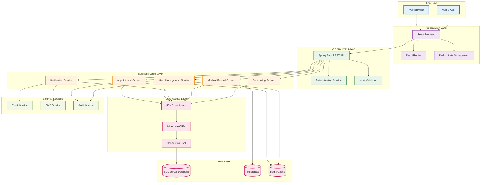

### 2.2 Microservices Architecture

```mermaid
graph TB
    subgraph "Frontend"
        ReactApp[React Application]
    end
    
    subgraph "API Gateway"
        Gateway[Spring Cloud Gateway]
        LoadBalancer[Load Balancer]
        RateLimiter[Rate Limiter]
    end
    
    subgraph "Core Services"
        AuthService[Authentication Service]
        UserService[User Management Service]
        AppointmentService[Appointment Service]
        NotificationService[Notification Service]
        MedicalService[Medical Record Service]
    end
    
    subgraph "Supporting Services"
        FileService[File Management Service]
        AuditService[Audit Service]
        ReportService[Reporting Service]
        ConfigService[Configuration Service]
    end
    
    subgraph "Data Stores"
        UserDB[(User Database)]
        AppointmentDB[(Appointment Database)]
        NotificationDB[(Notification Database)]
        MedicalDB[(Medical Database)]
        FileStore[(File Storage)]
        Cache[(Redis Cache)]
    end
    
    subgraph "External Integration"
        EmailAPI[Email Service API]
        SMSAPI[SMS Service API]
        CalendarAPI[Calendar API]
    end
    
    %% Client connections
    ReactApp --> Gateway
    Gateway --> LoadBalancer
    Gateway --> RateLimiter
    
    %% Service connections
    Gateway --> AuthService
    Gateway --> UserService
    Gateway --> AppointmentService
    Gateway --> NotificationService
    Gateway --> MedicalService
    
    %% Supporting service connections
    UserService --> FileService
    AppointmentService --> AuditService
    NotificationService --> ReportService
    AuthService --> ConfigService
    
    %% Database connections
    AuthService --> UserDB
    UserService --> UserDB
    AppointmentService --> AppointmentDB
    NotificationService --> NotificationDB
    MedicalService --> MedicalDB
    FileService --> FileStore
    
    %% Cache connections
    AuthService --> Cache
    UserService --> Cache
    AppointmentService --> Cache
    
    %% External connections
    NotificationService --> EmailAPI
    NotificationService --> SMSAPI
    AppointmentService --> CalendarAPI
    
    %% Styling
    classDef frontend fill:#e3f2fd,stroke:#1976d2,stroke-width:2px
    classDef gateway fill:#f3e5f5,stroke:#7b1fa2,stroke-width:2px
    classDef core fill:#e8f5e8,stroke:#388e3c,stroke-width:2px
    classDef supporting fill:#fff3e0,stroke:#f57c00,stroke-width:2px
    classDef data fill:#fce4ec,stroke:#c2185b,stroke-width:2px
    classDef external fill:#f1f8e9,stroke:#689f38,stroke-width:2px
    
    class ReactApp frontend
    class Gateway,LoadBalancer,RateLimiter gateway
    class AuthService,UserService,AppointmentService,NotificationService,MedicalService core
    class FileService,AuditService,ReportService,ConfigService supporting
    class UserDB,AppointmentDB,NotificationDB,MedicalDB,FileStore,Cache data
    class EmailAPI,SMSAPI,CalendarAPI external
```

---

## 3. Entity Relationship Diagrams

### 3.1 Complete Database Schema ERD

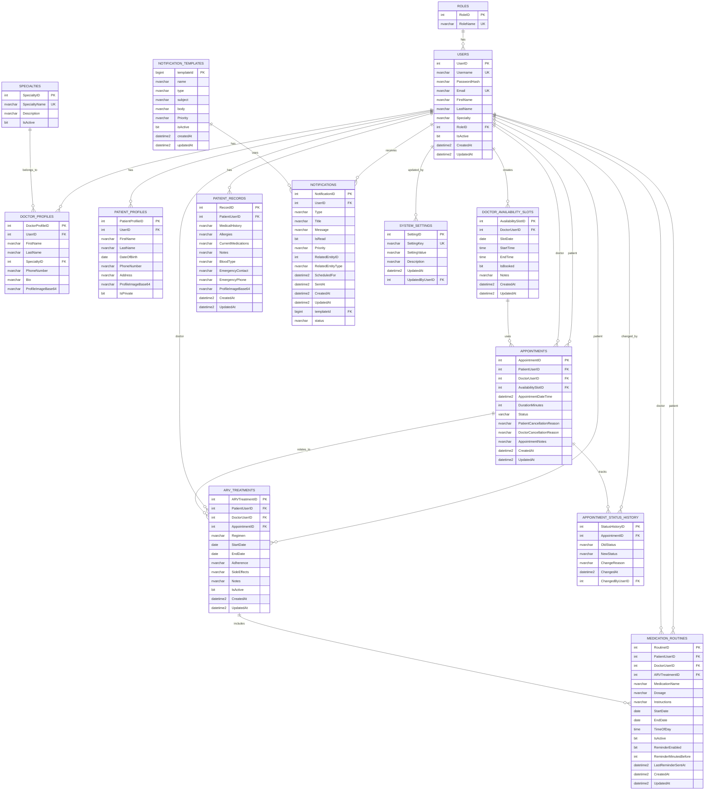

### 3.2 Core Business Entities ERD

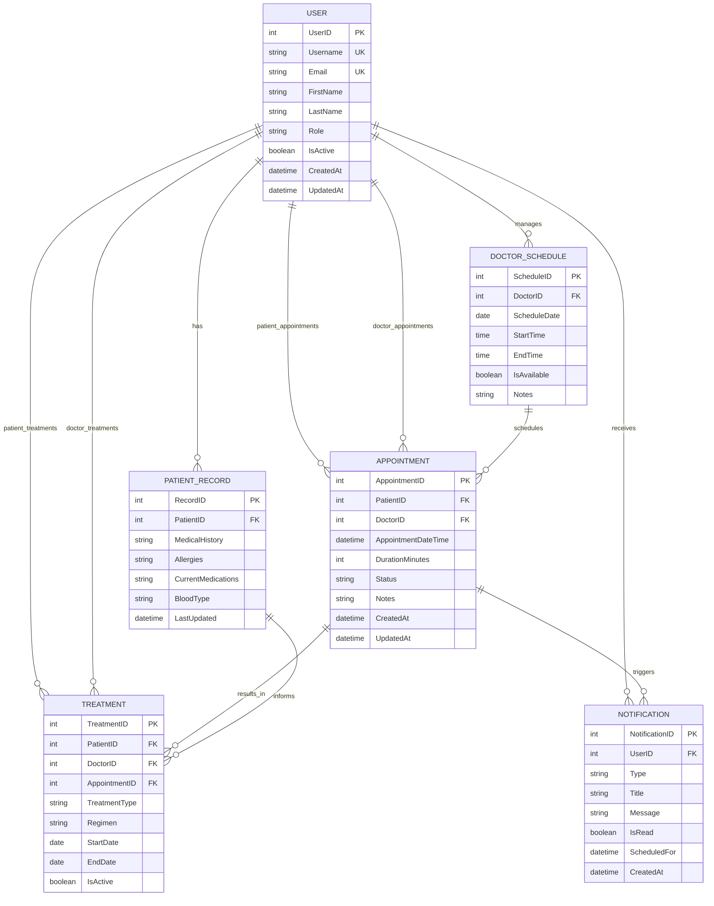

---

## 4. Sequence Diagrams

### 4.1 Appointment Booking Sequence

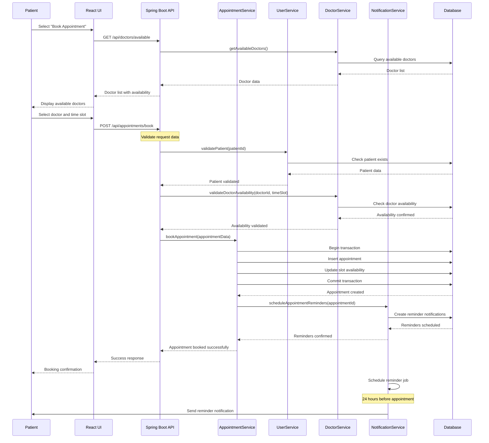

### 4.2 Patient Authentication Sequence

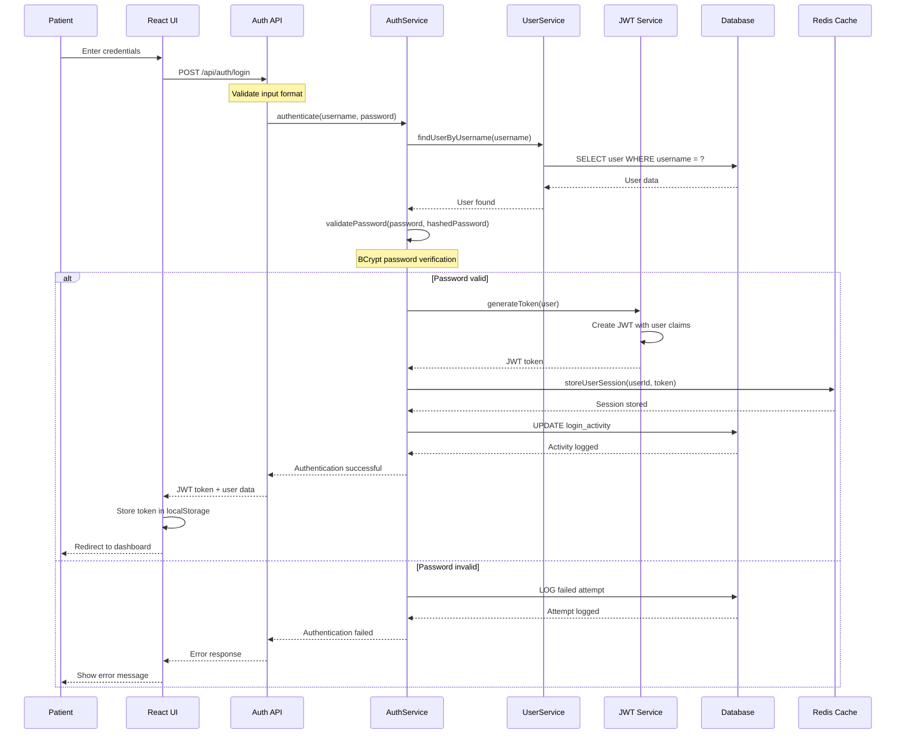

### 4.3 Notification Processing Sequence

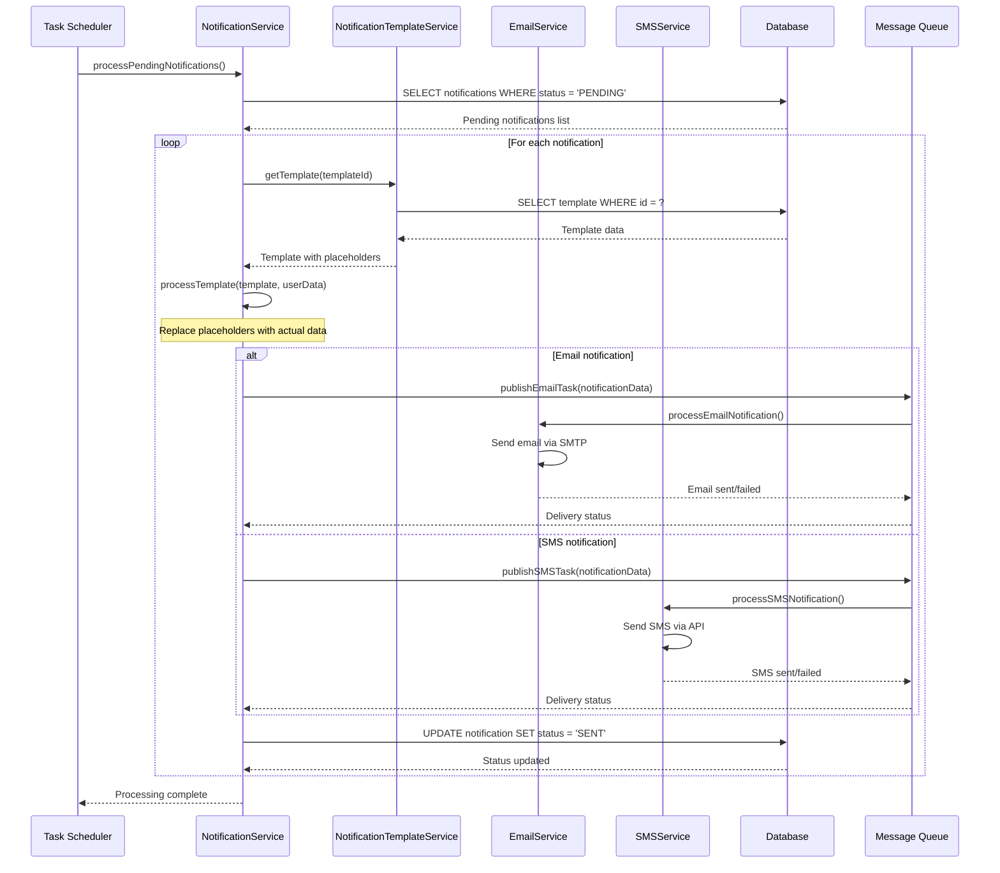

### 4.4 Doctor Schedule Management Sequence

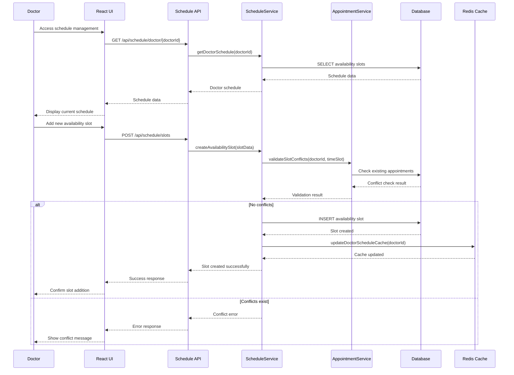

---

## 5. Class Diagrams

### 5.1 Core Domain Classes

```mermaid
classDiagram
    class User {
        +int userId
        +String username
        +String email
        +String firstName
        +String lastName
        +Role role
        +boolean isActive
        +LocalDateTime createdAt
        +LocalDateTime updatedAt
        +login()
        +logout()
        +updateProfile()
        +resetPassword()
    }
    
    class Role {
        +int roleId
        +String roleName
        +Set~Permission~ permissions
        +hasPermission(String permission)
    }
    
    class Patient {
        +PatientProfile profile
        +List~Appointment~ appointments
        +PatientRecord medicalRecord
        +List~Notification~ notifications
        +bookAppointment(Doctor doctor, LocalDateTime dateTime)
        +cancelAppointment(int appointmentId)
        +viewAppointments()
        +updateMedicalRecord()
    }
    
    class Doctor {
        +DoctorProfile profile
        +Specialty specialty
        +List~Appointment~ appointments
        +List~AvailabilitySlot~ availabilitySlots
        +List~Patient~ patients
        +setAvailability(LocalDate date, LocalTime start, LocalTime end)
        +viewPatientRecord(int patientId)
        +updateAppointmentNotes(int appointmentId, String notes)
        +prescribeMedication(int patientId, String medication)
    }
    
    class Appointment {
        +int appointmentId
        +Patient patient
        +Doctor doctor
        +LocalDateTime appointmentDateTime
        +int durationMinutes
        +AppointmentStatus status
        +String notes
        +LocalDateTime createdAt
        +LocalDateTime updatedAt
        +confirm()
        +cancel(String reason)
        +reschedule(LocalDateTime newDateTime)
        +complete()
    }
    
    class PatientProfile {
        +int profileId
        +String firstName
        +String lastName
        +LocalDate dateOfBirth
        +String phoneNumber
        +String address
        +boolean isPrivate
        +String profileImage
        +updateProfile()
        +setPrivacySettings(boolean isPrivate)
    }
    
    class DoctorProfile {
        +int profileId
        +String firstName
        +String lastName
        +Specialty specialty
        +String phoneNumber
        +String bio
        +String profileImage
        +updateProfile()
        +updateBio(String bio)
    }
    
    class Specialty {
        +int specialtyId
        +String specialtyName
        +String description
        +boolean isActive
        +List~Doctor~ doctors
    }
    
    class AvailabilitySlot {
        +int slotId
        +Doctor doctor
        +LocalDate slotDate
        +LocalTime startTime
        +LocalTime endTime
        +boolean isBooked
        +String notes
        +book()
        +release()
        +isAvailable()
    }
    
    class Notification {
        +int notificationId
        +User user
        +NotificationType type
        +String title
        +String message
        +boolean isRead
        +Priority priority
        +LocalDateTime scheduledFor
        +LocalDateTime sentAt
        +markAsRead()
        +send()
    }
    
    class NotificationTemplate {
        +long templateId
        +String name
        +NotificationType type
        +String subject
        +String body
        +Priority priority
        +boolean isActive
        +generateNotification(Map~String,Object~ data)
    }
    
    %% Relationships
    User ||--|| Role : has
    User ||--|| Patient : extends
    User ||--|| Doctor : extends
    Patient ||--|| PatientProfile : has
    Doctor ||--|| DoctorProfile : has
    Doctor ||--|| Specialty : belongs_to
    Doctor ||--o{ AvailabilitySlot : creates
    Patient ||--o{ Appointment : books
    Doctor ||--o{ Appointment : accepts
    Appointment ||--|| AvailabilitySlot : uses
    User ||--o{ Notification : receives
    NotificationTemplate ||--o{ Notification : generates
    
    %% Enums
    class AppointmentStatus {
        <<enumeration>>
        SCHEDULED
        CONFIRMED
        CANCELLED
        COMPLETED
        NO_SHOW
    }
    
    class NotificationType {
        <<enumeration>>
        APPOINTMENT_REMINDER
        MEDICATION_REMINDER
        GENERAL_ALERT
        SYSTEM_NOTIFICATION
    }
    
    class Priority {
        <<enumeration>>
        LOW
        MEDIUM
        HIGH
        URGENT
    }
    
    Appointment ||--|| AppointmentStatus : has
    Notification ||--|| NotificationType : has
    Notification ||--|| Priority : has
    NotificationTemplate ||--|| NotificationType : has
    NotificationTemplate ||--|| Priority : has
```

### 5.2 Service Layer Classes

```mermaid
classDiagram
    class AppointmentService {
        -AppointmentRepository appointmentRepository
        -UserRepository userRepository
        -NotificationService notificationService
        +bookAppointment(AppointmentBookingRequest request) MessageResponse
        +cancelAppointment(int appointmentId, String reason) MessageResponse
        +getPatientAppointments(int patientId) List~Appointment~
        +getDoctorAppointments(int doctorId) List~Appointment~
        +updateAppointmentStatus(int appointmentId, String status) MessageResponse
        +rescheduleAppointment(int appointmentId, LocalDateTime newDateTime) MessageResponse
        -validateBookingRequest(AppointmentBookingRequest request) boolean
        -checkConflicts(int userId, LocalDateTime dateTime) boolean
    }
    
    class UserService {
        -UserRepository userRepository
        -PasswordEncoder passwordEncoder
        -JwtService jwtService
        +authenticate(String username, String password) AuthResponse
        +registerPatient(PatientRegistrationRequest request) MessageResponse
        +updateUserProfile(int userId, UserProfileRequest request) MessageResponse
        +resetPassword(String email) MessageResponse
        +getUserById(int userId) User
        +changePassword(int userId, String oldPassword, String newPassword) MessageResponse
        -validateUserData(UserRegistrationRequest request) boolean
        -sendPasswordResetEmail(String email) void
    }
    
    class NotificationService {
        -NotificationRepository notificationRepository
        -NotificationTemplateRepository templateRepository
        -EmailService emailService
        -SMSService smsService
        +sendNotification(NotificationRequest request) MessageResponse
        +getUserNotifications(int userId) List~Notification~
        +markAsRead(int notificationId) MessageResponse
        +scheduleNotification(int userId, NotificationType type, LocalDateTime scheduledFor) void
        +processTemplate(NotificationTemplate template, Map~String,Object~ data) String
        -sendEmailNotification(Notification notification) void
        -sendSMSNotification(Notification notification) void
    }
    
    class ScheduleService {
        -AvailabilitySlotRepository slotRepository
        -AppointmentRepository appointmentRepository
        +createAvailabilitySlot(AvailabilitySlotRequest request) MessageResponse
        +getDoctorSchedule(int doctorId, LocalDate date) List~AvailabilitySlot~
        +updateAvailabilitySlot(int slotId, AvailabilitySlotRequest request) MessageResponse
        +deleteAvailabilitySlot(int slotId) MessageResponse
        +getAvailableSlots(int doctorId, LocalDate startDate, LocalDate endDate) List~AvailabilitySlot~
        -validateSlotConflicts(int doctorId, LocalDate date, LocalTime startTime, LocalTime endTime) boolean
    }
    
    class MedicalRecordService {
        -PatientRecordRepository recordRepository
        -ARVTreatmentRepository treatmentRepository
        -FileService fileService
        +getPatientRecord(int patientId) PatientRecord
        +updateMedicalHistory(int patientId, String medicalHistory) MessageResponse
        +addTreatment(int patientId, TreatmentRequest request) MessageResponse
        +updateTreatment(int treatmentId, TreatmentRequest request) MessageResponse
        +uploadDocument(int patientId, MultipartFile file) MessageResponse
        +getPatientTreatments(int patientId) List~ARVTreatment~
        -validateMedicalData(String data) boolean
    }
    
    class AuthenticationService {
        -UserService userService
        -JwtService jwtService
        -RedisService redisService
        +login(LoginRequest request) AuthResponse
        +logout(String token) MessageResponse
        +refreshToken(String refreshToken) AuthResponse
        +validateToken(String token) boolean
        +getCurrentUser(String token) User
        -generateTokens(User user) TokenPair
        -invalidateToken(String token) void
    }
    
    %% Service Dependencies
    AppointmentService --> NotificationService : uses
    AppointmentService --> UserService : uses
    NotificationService --> ScheduleService : uses
    AuthenticationService --> UserService : uses
    MedicalRecordService --> UserService : uses
    
    %% Repository Dependencies
    class AppointmentRepository {
        <<interface>>
        +findByPatientUser(User patient) List~Appointment~
        +findByDoctorUser(User doctor) List~Appointment~
        +findByPatientUserAndAppointmentDateTimeBetween(User patient, LocalDateTime start, LocalDateTime end) List~Appointment~
    }
    
    class UserRepository {
        <<interface>>
        +findByUsername(String username) Optional~User~
        +findByEmail(String email) Optional~User~
        +findByRole(Role role) List~User~
    }
    
    class NotificationRepository {
        <<interface>>
        +findByUserAndIsRead(User user, boolean isRead) List~Notification~
        +findByScheduledForBefore(LocalDateTime dateTime) List~Notification~
    }
    
    AppointmentService --> AppointmentRepository : uses
    UserService --> UserRepository : uses
    NotificationService --> NotificationRepository : uses
```

---

## 6. Component Diagrams

### 6.1 Frontend Component Architecture

```mermaid
graph TB
    subgraph "Application Shell"
        App[App Component]
        Router[React Router]
        AuthProvider[Authentication Context]
        ThemeProvider[Theme Provider]
    end
    
    subgraph "Layout Components"
        Header[Header Component]
        Navigation[Navigation Component]
        Sidebar[Sidebar Component]
        Footer[Footer Component]
    end
    
    subgraph "Authentication Components"
        LoginForm[Login Form]
        RegisterForm[Register Form]
        ForgotPassword[Forgot Password]
        ProtectedRoute[Protected Route]
    end
    
    subgraph "Patient Components"
        PatientDashboard[Patient Dashboard]
        AppointmentBooking[Appointment Booking]
        AppointmentList[Appointment List]
        PatientProfile[Patient Profile]
        MedicalHistory[Medical History]
    end
    
    subgraph "Doctor Components"
        DoctorDashboard[Doctor Dashboard]
        ScheduleManagement[Schedule Management]
        PatientList[Patient List]
        AppointmentDetails[Appointment Details]
        DoctorProfile[Doctor Profile]
    end
    
    subgraph "Shared Components"
        Calendar[Calendar Component]
        DatePicker[Date Picker]
        NotificationBell[Notification Bell]
        LoadingSpinner[Loading Spinner]
        ErrorBoundary[Error Boundary]
        Modal[Modal Component]
    end
    
    subgraph "Services"
        ApiService[API Service]
        AuthService[Auth Service]
        NotificationService[Notification Service]
        StorageService[Storage Service]
    end
    
    subgraph "State Management"
        Redux[Redux Store]
        AuthSlice[Auth Slice]
        AppointmentSlice[Appointment Slice]
        NotificationSlice[Notification Slice]
        UserSlice[User Slice]
    end
    
    %% App Structure
    App --> Router
    App --> AuthProvider
    App --> ThemeProvider
    App --> ErrorBoundary
    
    %% Layout
    Router --> Header
    Router --> Navigation
    Router --> Sidebar
    Router --> Footer
    
    %% Authentication Flow
    Router --> LoginForm
    Router --> RegisterForm
    Router --> ForgotPassword
    Router --> ProtectedRoute
    
    %% Patient Flow
    ProtectedRoute --> PatientDashboard
    PatientDashboard --> AppointmentBooking
    PatientDashboard --> AppointmentList
    PatientDashboard --> PatientProfile
    PatientDashboard --> MedicalHistory
    
    %% Doctor Flow
    ProtectedRoute --> DoctorDashboard
    DoctorDashboard --> ScheduleManagement
    DoctorDashboard --> PatientList
    DoctorDashboard --> AppointmentDetails
    DoctorDashboard --> DoctorProfile
    
    %% Shared Components Usage
    AppointmentBooking --> Calendar
    AppointmentBooking --> DatePicker
    ScheduleManagement --> Calendar
    Header --> NotificationBell
    App --> LoadingSpinner
    App --> Modal
    
    %% Service Integration
    LoginForm --> ApiService
    LoginForm --> AuthService
    AppointmentBooking --> ApiService
    NotificationBell --> NotificationService
    
    %% State Management
    AuthProvider --> Redux
    Redux --> AuthSlice
    Redux --> AppointmentSlice
    Redux --> NotificationSlice
    Redux --> UserSlice
    
    %% Styling
    classDef app fill:#e3f2fd,stroke:#1976d2,stroke-width:2px
    classDef layout fill:#f3e5f5,stroke:#7b1fa2,stroke-width:2px
    classDef auth fill:#e8f5e8,stroke:#388e3c,stroke-width:2px
    classDef patient fill:#fff3e0,stroke:#f57c00,stroke-width:2px
    classDef doctor fill:#fce4ec,stroke:#c2185b,stroke-width:2px
    classDef shared fill:#f1f8e9,stroke:#689f38,stroke-width:2px
    classDef service fill:#e0f2f1,stroke:#00695c,stroke-width:2px
    classDef state fill:#fef7e0,stroke:#ef6c00,stroke-width:2px
    
    class App,Router,AuthProvider,ThemeProvider app
    class Header,Navigation,Sidebar,Footer layout
    class LoginForm,RegisterForm,ForgotPassword,ProtectedRoute auth
    class PatientDashboard,AppointmentBooking,AppointmentList,PatientProfile,MedicalHistory patient
    class DoctorDashboard,ScheduleManagement,PatientList,AppointmentDetails,DoctorProfile doctor
    class Calendar,DatePicker,NotificationBell,LoadingSpinner,ErrorBoundary,Modal shared
    class ApiService,AuthService,NotificationService,StorageService service
    class Redux,AuthSlice,AppointmentSlice,NotificationSlice,UserSlice state
```

### 6.2 Backend Component Architecture

```mermaid
graph TB
    subgraph "Web Layer"
        RestController[REST Controllers]
        ExceptionHandler[Global Exception Handler]
        RequestValidator[Request Validator]
        ResponseWrapper[Response Wrapper]
    end
    
    subgraph "Security Layer"
        JwtFilter[JWT Authentication Filter]
        AuthorizationFilter[Authorization Filter]
        CorsConfig[CORS Configuration]
        SecurityConfig[Security Configuration]
    end
    
    subgraph "Service Layer"
        AppointmentServiceImpl[Appointment Service]
        UserServiceImpl[User Service]
        NotificationServiceImpl[Notification Service]
        ScheduleServiceImpl[Schedule Service]
        MedicalRecordServiceImpl[Medical Record Service]
        AuthServiceImpl[Authentication Service]
    end
    
    subgraph "Repository Layer"
        AppointmentRepo[Appointment Repository]
        UserRepo[User Repository]
        NotificationRepo[Notification Repository]
        ScheduleRepo[Schedule Repository]
        MedicalRecordRepo[Medical Record Repository]
    end
    
    subgraph "Data Layer"
        JpaConfig[JPA Configuration]
        DatabaseConfig[Database Configuration]
        TransactionManager[Transaction Manager]
        ConnectionPool[Connection Pool]
    end
    
    subgraph "Integration Layer"
        EmailService[Email Service]
        SMSService[SMS Service]
        FileService[File Service]
        AuditService[Audit Service]
    end
    
    subgraph "Configuration"
        AppConfig[Application Configuration]
        WebConfig[Web Configuration]
        SchedulerConfig[Scheduler Configuration]
        CacheConfig[Cache Configuration]
    end
    
    subgraph "External Systems"
        Database[(SQL Server)]
        RedisCache[(Redis Cache)]
        EmailProvider[Email Provider]
        SMSProvider[SMS Provider]
        FileStorage[File Storage]
    end
    
    %% Web Layer Connections
    RestController --> ExceptionHandler
    RestController --> RequestValidator
    RestController --> ResponseWrapper
    
    %% Security Layer Connections
    RestController --> JwtFilter
    JwtFilter --> AuthorizationFilter
    AuthorizationFilter --> CorsConfig
    CorsConfig --> SecurityConfig
    
    %% Service Layer Connections
    RestController --> AppointmentServiceImpl
    RestController --> UserServiceImpl
    RestController --> NotificationServiceImpl
    RestController --> ScheduleServiceImpl
    RestController --> MedicalRecordServiceImpl
    RestController --> AuthServiceImpl
    
    %% Repository Layer Connections
    AppointmentServiceImpl --> AppointmentRepo
    UserServiceImpl --> UserRepo
    NotificationServiceImpl --> NotificationRepo
    ScheduleServiceImpl --> ScheduleRepo
    MedicalRecordServiceImpl --> MedicalRecordRepo
    AuthServiceImpl --> UserRepo
    
    %% Data Layer Connections
    AppointmentRepo --> JpaConfig
    UserRepo --> JpaConfig
    NotificationRepo --> JpaConfig
    ScheduleRepo --> JpaConfig
    MedicalRecordRepo --> JpaConfig
    
    JpaConfig --> DatabaseConfig
    DatabaseConfig --> TransactionManager
    TransactionManager --> ConnectionPool
    
    %% Integration Layer Connections
    NotificationServiceImpl --> EmailService
    NotificationServiceImpl --> SMSService
    MedicalRecordServiceImpl --> FileService
    AppointmentServiceImpl --> AuditService
    
    %% Configuration Connections
    AppConfig --> WebConfig
    WebConfig --> SchedulerConfig
    SchedulerConfig --> CacheConfig
    
    %% External System Connections
    ConnectionPool --> Database
    CacheConfig --> RedisCache
    EmailService --> EmailProvider
    SMSService --> SMSProvider
    FileService --> FileStorage
    
    %% Styling
    classDef web fill:#e3f2fd,stroke:#1976d2,stroke-width:2px
    classDef security fill:#f3e5f5,stroke:#7b1fa2,stroke-width:2px
    classDef service fill:#e8f5e8,stroke:#388e3c,stroke-width:2px
    classDef repository fill:#fff3e0,stroke:#f57c00,stroke-width:2px
    classDef data fill:#fce4ec,stroke:#c2185b,stroke-width:2px
    classDef integration fill:#f1f8e9,stroke:#689f38,stroke-width:2px
    classDef config fill:#e0f2f1,stroke:#00695c,stroke-width:2px
    classDef external fill:#fef7e0,stroke:#ef6c00,stroke-width:2px
    
    class RestController,ExceptionHandler,RequestValidator,ResponseWrapper web
    class JwtFilter,AuthorizationFilter,CorsConfig,SecurityConfig security
    class AppointmentServiceImpl,UserServiceImpl,NotificationServiceImpl,ScheduleServiceImpl,MedicalRecordServiceImpl,AuthServiceImpl service
    class AppointmentRepo,UserRepo,NotificationRepo,ScheduleRepo,MedicalRecordRepo repository
    class JpaConfig,DatabaseConfig,TransactionManager,ConnectionPool data
    class EmailService,SMSService,FileService,AuditService integration
    class AppConfig,WebConfig,SchedulerConfig,CacheConfig config
    class Database,RedisCache,EmailProvider,SMSProvider,FileStorage external
```

---

## 7. State Diagrams

### 7.1 Appointment State Diagram

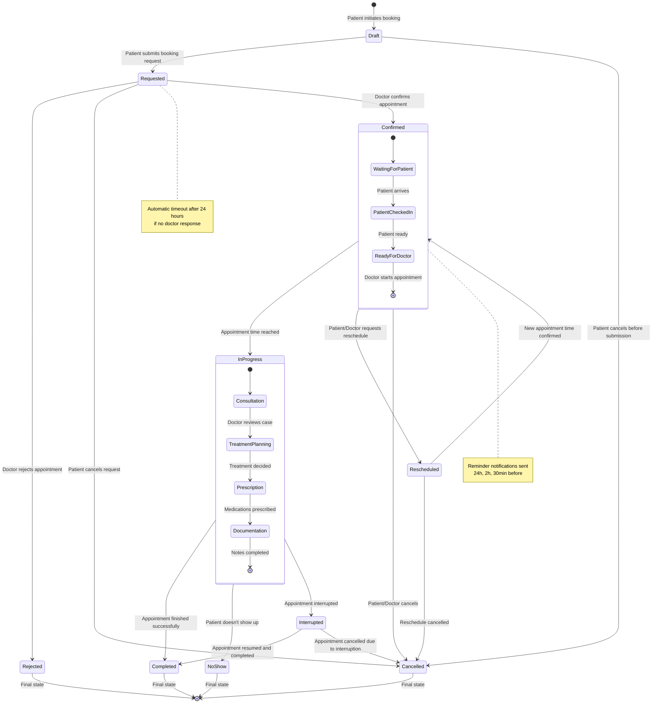

### 7.2 User Authentication State Diagram

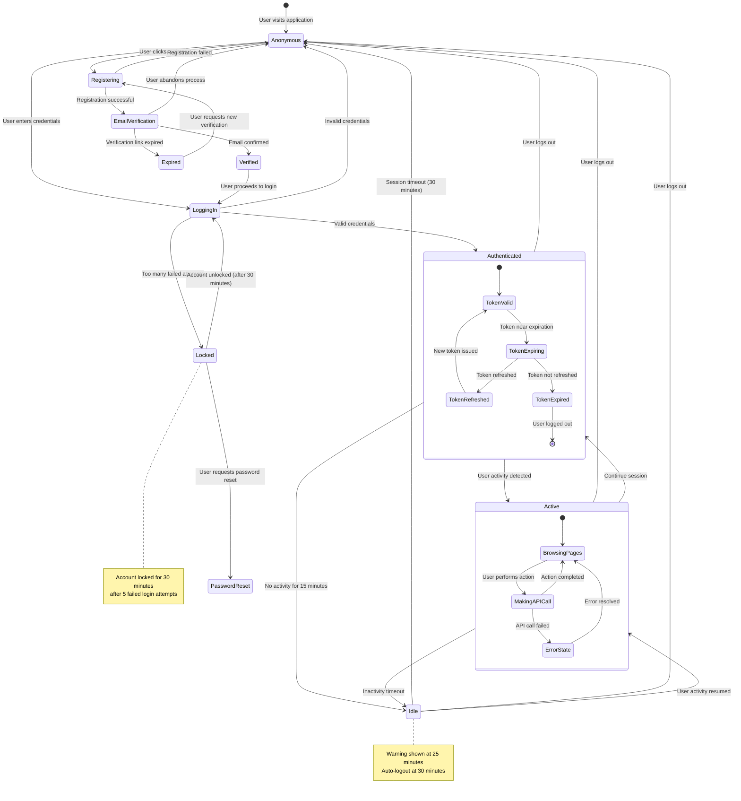

### 7.3 Notification Processing State Diagram

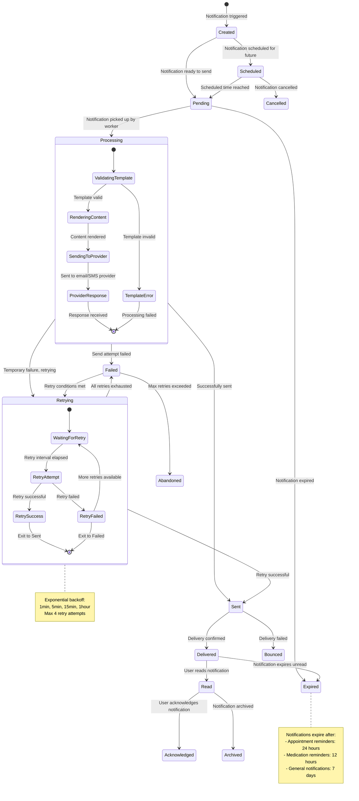

---

## 8. Data Flow Diagrams

### 8.1 Level 0 Context Diagram

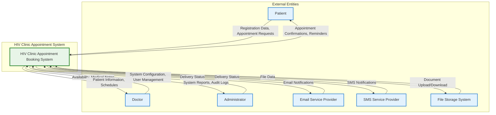

### 8.2 Level 1 Data Flow Diagram

```mermaid
graph TB
    subgraph "External Entities"
        Patient[Patient]
        Doctor[Doctor]
        Admin[Administrator]
        EmailSvc[Email Service]
        SMSSvc[SMS Service]
    end
    
    subgraph "HIV Clinic System Processes"
        P1[1.0 User Authentication]
        P2[2.0 Appointment Management]
        P3[3.0 Schedule Management]
        P4[4.0 Notification Processing]
        P5[5.0 Medical Record Management]
        P6[6.0 System Administration]
    end
    
    subgraph "Data Stores"
        DS1[(D1 Users)]
        DS2[(D2 Appointments)]
        DS3[(D3 Schedules)]
        DS4[(D4 Notifications)]
        DS5[(D5 Medical Records)]
        DS6[(D6 System Settings)]
    end
    
    %% Patient flows
    Patient -->|Login Credentials| P1
    P1 -->|Authentication Result| Patient
    Patient -->|Appointment Request| P2
    P2 -->|Booking Confirmation| Patient
    Patient -->|Profile Updates| P5
    P5 -->|Updated Profile| Patient
    
    %% Doctor flows
    Doctor -->|Login Credentials| P1
    P1 -->|Authentication Result| Doctor
    Doctor -->|Availability Data| P3
    P3 -->|Schedule Confirmation| Doctor
    Doctor -->|Medical Notes| P5
    P5 -->|Patient Records| Doctor
    
    %% Admin flows
    Admin -->|Login Credentials| P1
    P1 -->|Authentication Result| Admin
    Admin -->|System Configuration| P6
    P6 -->|System Status| Admin
    
    %% Process to Data Store flows
    P1 -->|User Data| DS1
    DS1 -->|User Records| P1
    
    P2 -->|Appointment Data| DS2
    DS2 -->|Appointment Records| P2
    
    P3 -->|Schedule Data| DS3
    DS3 -->|Schedule Records| P3
    
    P4 -->|Notification Data| DS4
    DS4 -->|Notification Records| P4
    
    P5 -->|Medical Data| DS5
    DS5 -->|Medical Records| P5
    
    P6 -->|Configuration Data| DS6
    DS6 -->|System Settings| P6
    
    %% Inter-process flows
    P2 -->|Appointment Events| P4
    P3 -->|Schedule Changes| P4
    P4 -->|Email Requests| EmailSvc
    P4 -->|SMS Requests| SMSSvc
    EmailSvc -->|Delivery Status| P4
    SMSSvc -->|Delivery Status| P4
    
    P1 -->|User Session| P2
    P1 -->|User Session| P3
    P1 -->|User Session| P5
    P1 -->|User Session| P6
    
    %% Styling
    classDef external fill:#e3f2fd,stroke:#1976d2,stroke-width:2px
    classDef process fill:#e8f5e8,stroke:#388e3c,stroke-width:2px
    classDef datastore fill:#fff3e0,stroke:#f57c00,stroke-width:2px
    
    class Patient,Doctor,Admin,EmailSvc,SMSSvc external
    class P1,P2,P3,P4,P5,P6 process
    class DS1,DS2,DS3,DS4,DS5,DS6 datastore
```

### 8.3 Level 2 Data Flow Diagram - Appointment Management

```mermaid
graph TB
    subgraph "External Entities"
        Patient[Patient]
        Doctor[Doctor]
    end
    
    subgraph "Appointment Management Processes"
        P21[2.1 Validate Appointment Request]
        P22[2.2 Check Availability]
        P23[2.3 Book Appointment]
        P24[2.4 Confirm Appointment]
        P25[2.5 Cancel Appointment]
        P26[2.6 Reschedule Appointment]
    end
    
    subgraph "Data Stores"
        DS1[(D1 Users)]
        DS2[(D2 Appointments)]
        DS3[(D3 Schedules)]
        DS4[(D4 Notifications)]
        DS7[(D7 Appointment History)]
    end
    
    subgraph "External Processes"
        P4[4.0 Notification Processing]
        P5[5.0 Medical Record Management]
    end
    
    %% Patient interactions
    Patient -->|Appointment Request| P21
    P21 -->|Validation Result| Patient
    Patient -->|Booking Confirmation| P23
    P23 -->|Appointment Details| Patient
    Patient -->|Cancellation Request| P25
    P25 -->|Cancellation Confirmation| Patient
    Patient -->|Resche